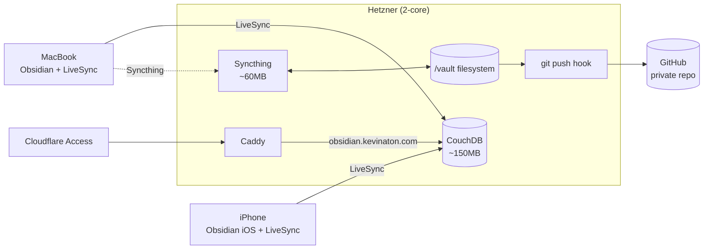

# Obsidian iPhone Sync — Options & Recommendation

## Context

`plan/reference/obsidian.md` defines the Knowledge layer of the HUD. MacBook sync is solved cleanly via Syncthing against `/vault` on Hetzner. The iPhone story, however, is a **custom-built browser viewer** at `hud.kevinaton.com/vault` that renders markdown and supports "basic editing".

That choice has three problems worth surfacing:

1. **iPhone loses Obsidian-the-app.** No plugins, no graph, no backlinks panel, no Tasks/Dataview, no Templater, no offline edit queue. The viewer is a markdown reader with a textarea, not a knowledge tool.
2. **A bespoke editor is code to maintain.** Conflict handling, file-locking, image attachments, frontmatter preservation, link resolution — every one of those is a small bug surface you now own.
3. **The "no Docker" constraint that rejected LiveSync in 2024 is worth re-pricing in 2026.** CouchDB single-node idles at ~120–180 MB RAM, well within budget on a 2-core, and LiveSync is now the de-facto community standard for iOS sync.

This blueprint compares the realistic 2026 options for getting *real Obsidian* on iPhone against `/vault` on Hetzner, and recommends one.

## Strategic Objective

- **3 months:** iPhone has the same vault as MacBook with sub-minute propagation, full Obsidian app (plugins, graph, backlinks), and no bespoke editor to maintain.
- **12 months:** Sync is invisible. No manual conflict resolution. Adding a 3rd device (iPad, second laptop) is a 5-minute setup.
- **24 months:** Architecture survives an Obsidian iOS update without breakage; survives Hetzner provider change with one config swap.

## Current State

Per `plan/reference/obsidian.md`:

- Server `/vault` is source of truth.
- MacBook: Syncthing daemon, real-time, fully functional Obsidian.
- iPhone: **browser viewer only** at `hud.kevinaton.com/vault` behind Cloudflare Access.
- Backup: cron pushes `/vault` to a private GitHub repo every 15 min.
- The doc lists alternatives rejected in 2024: Obsidian Sync ($9/mo), iCloud, Syncthing iOS (no native app), BYOC+R2 (no mobile support — *now outdated, see below*), LiveSync+CouchDB ("requires Docker — bloats 2-core server"), Nextcloud.

Two of those rejections are stale in 2026 and worth revisiting:

- **BYOC + R2** — Remotely Save plugin works on iOS today and supports Cloudflare R2 directly. The 2024 statement "no mobile plugin support" is no longer accurate.
- **LiveSync + CouchDB** — CouchDB single-node is ~150 MB RAM idle; LiveSync is the most-recommended iOS-capable sync in the Obsidian community as of 2026.

## Proposed Approach

**Recommendation: Self-hosted LiveSync + CouchDB on Hetzner, with `obsidian.kevinaton.com` reverse-proxied by Caddy and gated by Cloudflare Access.**

Why:
- iOS gets the **real Obsidian app** — full plugin/graph experience.
- Real-time, chunk-level sync; CouchDB's replication protocol handles conflicts natively (no merge prompts).
- Single moving part on the server (CouchDB), accessible via the Caddy that's already running.
- E2E encryption inside LiveSync — even if Cloudflare Access fronting is bypassed, vault data is encrypted at rest in CouchDB.
- GitHub backup hook keeps working unchanged — server `/vault` becomes a *replica* synced from CouchDB via the desktop Obsidian client running headless… **or** we keep `/vault` as the authoritative filesystem mirror by running the Obsidian desktop client on the server in headless mode (optional, see Phase 3).

Topology:

Notes on the topology:
- **CouchDB is the live sync hub.** Both Obsidian clients (MacBook + iPhone) sync via LiveSync plugin to CouchDB.
- **Syncthing keeps the filesystem `/vault` as the canonical mirror** for the GitHub backup and any future server-side processing (search, RAG, vault viewer, etc.). MacBook Obsidian vault directory is what Syncthing watches — so any change made from MacBook flows to both CouchDB (via LiveSync) and `/vault` (via Syncthing).
- **iPhone changes** flow CouchDB → MacBook (LiveSync) → `/vault` (Syncthing). One extra hop, ~1–3 sec.
- **No Docker required** — CouchDB has a native Debian/Ubuntu package (`apt install couchdb`).
- **GitHub backup hook unchanged.**

### Why not just Remotely Save → R2 (no server-side DB)

It works and is simpler operationally, but trade-offs:
- Conflict handling is "last writer wins" with backup files, not chunk-level merge. Acceptable for solo use, painful if you ever edit the same note on two devices within the same sync window.
- No real-time — minimum sync interval is typically 1–5 min, and only on app foreground.
- R2 egress is free, but the loop adds a third-party data plane outside your perimeter (Cloudflare R2 instead of just your Hetzner box).
- Your `/vault` filesystem is no longer the source of truth — the bucket is — which complicates the GitHub backup and the future vault viewer.

Kept as the documented fallback in §Alternatives.

## Alternatives Considered

| # | Option | Pros | Cons | Verdict |
|---|---|---|---|---|
| A | **Self-hosted LiveSync + CouchDB** (recommended) | Real Obsidian on iOS, real-time, chunk-merge, E2E encryption, free, self-hosted | Adds CouchDB (~150 MB RAM), new auth surface | **Adopt** |
| B | **Remotely Save → Cloudflare R2** | Simplest server: nothing new to run. R2 free egress. iOS plugin works. | Not real-time; LWW conflicts; bucket becomes source of truth | Fallback if CouchDB ops feel too heavy |
| C | **Remotely Save → WebDAV via Caddy** | Caddy has `webdav` module; no new daemon; `/vault` stays source of truth | LWW conflicts; sync interval; WebDAV implementation quirks on iOS | Reasonable if R2 not desired |
| D | **Obsidian Sync (official)** | Zero ops, official, E2E | $4–10/mo, data on Obsidian's servers, lock-in | Not aligned with self-host principle |
| E | **iCloud Drive vault on iPhone** | Native iOS | Fragile, opaque conflicts, requires same iCloud-vault path on MacBook — breaks Syncthing model | Rejected (already rejected in current doc; still correct) |
| F | **Git sync via Working Copy + obsidian-git** | Familiar, free | iOS git on Obsidian vaults is *notoriously* unreliable — merge conflicts, dirty trees, partial pulls. Community consensus 2026: do not. | Rejected |
| G | **Status quo: browser viewer** | No iOS app dependency | Not real Obsidian; bespoke code to maintain; loses plugins/graph | Rejected |

## Security & Threat Model

**Trust boundaries:**
- Public internet → Cloudflare Access → Caddy → CouchDB (`obsidian.kevinaton.com`)
- LAN/dev only: CouchDB admin port (5984) bound to `127.0.0.1`, never published.
- LiveSync vault data is **E2E encrypted with a passphrase** before leaving the device; CouchDB sees only ciphertext blobs.

**STRIDE:**
- **Spoofing** — Cloudflare Access enforces SSO + MFA on the public hostname. CouchDB itself requires Basic Auth (per-device user) inside the Access tunnel. Two layers.
- **Tampering** — LiveSync chunk hashes + CouchDB revision tree; tampered chunks fail decryption. TLS 1.3 from device → Cloudflare → Caddy → CouchDB.
- **Repudiation** — CouchDB has per-document `_rev` history; Caddy access logs shipped to journald; Cloudflare Access logs identity per request.
- **Information disclosure** — Even if CouchDB DB files leak (e.g., Hetzner disk seizure), data is E2E-encrypted by LiveSync. CouchDB-at-rest encryption (LUKS) optional second layer. No PII rule from the existing doc still applies.
- **Denial of service** — Cloudflare in front absorbs L3/L4. Caddy rate-limits `/obsidian/*`. CouchDB `max_dbs_open` and `max_document_size` capped. Vault size monitored — alert at 80% of 5 GB.
- **Elevation of privilege** — CouchDB admin party disabled (`[admins]` section set on first boot). Per-device CouchDB users with read/write only on the single vault DB. No `_users` access.

**Controls (mapped):**
- Cloudflare Access (SSO+MFA) → Spoofing, DoS
- LiveSync E2E passphrase → Information disclosure (server-side compromise)
- Per-device CouchDB users + scoped DB permissions → Elevation
- TLS 1.3 everywhere → Tampering, Information disclosure (in transit)
- CouchDB bound to localhost, only Caddy proxies it → Spoofing, Elevation
- GitHub backup repo private + Cloudflare Access on viewer → Information disclosure
- Rate limit on Caddy `obsidian.kevinaton.com` → DoS

**Residual risk:**
- Loss of LiveSync passphrase = unrecoverable vault on new devices (passphrase must be in 1Password / secrets store).
- Cloudflare Access compromise + Cloudflare → origin tunnel = ciphertext exposure only (still E2E-safe). Catastrophic only if passphrase also leaked.
- CouchDB CVEs — subscribe to Debian security list; auto-apply `couchdb` package updates via unattended-upgrades.

## Risks & Mitigations

| Risk | Detection | Response |
|---|---|---|
| CouchDB RAM creep on small server | `node_exporter` alert at 400 MB CouchDB RSS | Tune `[couchdb] max_dbs_open`, restart; consider SWAP cap |
| LiveSync passphrase lost | User report (cannot setup new device) | Vault is recoverable from `/vault` filesystem (Syncthing mirror) + GitHub backup — re-init LiveSync fresh |
| Conflict during MacBook offline + iPhone heavy edit | Obsidian shows conflict banner | LiveSync auto-merges at chunk level; manual review only for true overlap |
| Syncthing → `/vault` lag corrupts GitHub backup mid-write | git commit hook fails | Switch backup from post-commit to a 15-min cron with `git add -A` (already in doc) |
| iPhone Obsidian app sandbox restrictions break LiveSync background sync | Notes not appearing after device idle | Foreground-sync only is the documented iOS behavior; user opens app to trigger sync |

## Phased Implementation

| Phase | Outcome | Depends on | Effort | Exit criteria |
|---|---|---|---|---|
| 1 | CouchDB installed, hardened, reachable only via Caddy on `obsidian.kevinaton.com` behind Cloudflare Access | Caddy already running, Cloudflare Access already configured | S (½ day) | `curl https://obsidian.kevinaton.com/` returns CouchDB welcome JSON through Access; admin party disabled; per-device users created |
| 2 | LiveSync plugin installed on MacBook Obsidian, initial sync of `/vault` into CouchDB with E2E passphrase | Phase 1 | S (½ day) | MacBook vault is round-trip identical pre/post LiveSync init; passphrase stored in secrets manager |
| 3 | iPhone Obsidian + LiveSync configured against same CouchDB | Phase 2 | S (1 hr) | Edit on iPhone appears on MacBook within 10 sec and vice-versa; offline edit on iPhone syncs on reconnect |
| 4 | Decommission browser vault viewer route OR keep as read-only fallback | Phase 3 stable for 2 weeks | XS | Decision recorded; route either removed from Caddy or re-scoped to read-only |
| 5 | Document runbook for: passphrase recovery, CouchDB upgrade, device re-pair, conflict resolution | Phase 3 | S | Runbook lives in `plan/reference/obsidian-livesync-ops.md` |

## Success Criteria

- iPhone edit → MacBook visible: **p95 < 15 sec** when both devices online.
- iPhone offline edit → reconciled on reconnect: **p95 < 30 sec** after foreground.
- Zero manual conflict prompts over 30 days of normal use.
- CouchDB process RSS **< 250 MB** at steady state.
- Vault on iPhone has working plugins (at minimum: Tasks, Dataview-read, Templater).
- GitHub backup contains every commit within 15 min of the corresponding MacBook write.

## Open Questions

- Do you want the **server `/vault` filesystem** to remain the source of truth (current model), or migrate canonical to CouchDB and let `/vault` be a derived mirror? Recommendation: **keep `/vault` canonical** — it's the only form GitHub and any future RAG indexer can read directly.
- Cloudflare Access policy for `obsidian.kevinaton.com` — same identity rules as `hud.kevinaton.com`, or stricter (e.g., require hardware key)?
- E2E passphrase storage — 1Password, `pass`, or a sealed envelope written into `plan/reference/secrets.md` (encrypted)?
- Acceptable max vault size for CouchDB on this host? Recommend a 5 GB soft cap with alert.

## Debt Incurred

None at this stage — this is a clean architectural choice. If you instead opt for **Option B (Remotely Save → R2)** as a stopgap to skip CouchDB install:
- Deferred: real-time sync, chunk-level conflict merge, single-system source of truth.
- Trigger to revisit: first time you hit a conflict you have to resolve by hand, or when adding a third device.
- Owner: Kevin.

## Tasks

To be generated once approach is confirmed:
- [ ] T-26060401 — Install and harden CouchDB on Hetzner
- [ ] T-26060402 — Add Caddy route `obsidian.kevinaton.com` with Cloudflare Access policy
- [ ] T-26060403 — Bootstrap LiveSync on MacBook against `/vault`
- [ ] T-26060404 — Bootstrap LiveSync on iPhone
- [ ] T-26060405 — Write `plan/reference/obsidian-livesync-ops.md` runbook
- [ ] T-26060406 — Update `plan/reference/obsidian.md` to reflect the new architecture (browser viewer demoted or removed)
