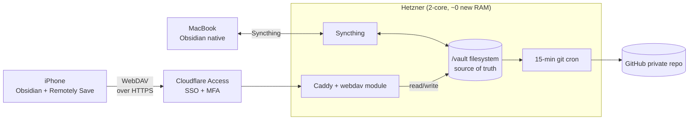

# Obsidian iPhone Sync — Caddy WebDAV + Remotely Save

## Context

Supersedes `26060401-obsidian-iphone-sync.md` (LiveSync + CouchDB).

The user's constraints, restated explicitly:
- **No paid services.** The whole point of the Hetzner box is to *not* pay $4–10/mo for Obsidian Sync. Same logic rules out Working Copy ($), GitSync ($), iCloud+ tiers, etc.
- **Manual sync on mobile is acceptable.** User already operates in a "open Termius → run claude" workflow on iPhone. Tapping a sync button in Obsidian before/after a session is the same ergonomic class.
- **Use the cloud server that's already paid for.** Don't push state into third-party data planes (R2, Dropbox, etc.) when Hetzner is sitting there idle.

Given those constraints, real-time chunk-merge sync (LiveSync's killer feature) is **over-engineering**. A button-press WebDAV sync is sufficient and removes an entire daemon (CouchDB) from the architecture.

## Strategic Objective

- **3 months:** iPhone runs real Obsidian against `/vault` on Hetzner via Caddy WebDAV. Manual sync on app open/close. Zero new daemons. Zero recurring cost.
- **12 months:** Architecture has not needed a maintenance touch. Vault on iPhone is just the vault.
- **24 months:** If life changes and real-time becomes worth the ops, upgrade path to LiveSync+CouchDB (blueprint `26060401`) is a 2-hour migration — same vault, same Cloudflare Access, same Caddy.

## Current State

- Server `/vault` is source of truth.
- MacBook ↔ `/vault` via Syncthing — works, keep it.
- iPhone has nothing (browser viewer is the current proposal in `plan/reference/obsidian.md`).
- Caddy is already running and reverse-proxying `hud.kevinaton.com`.
- Cloudflare Access is already configured for the dashboard.
- GitHub backup via 15-min cron is already running.

What's missing: a WebDAV endpoint Obsidian iOS can talk to.

## Proposed Approach

**Add a `caddy-webdav` route at `vault.kevinaton.com` pointing directly at `/vault`, behind Cloudflare Access, with the Remotely Save Obsidian plugin on iPhone configured to sync against it.**

### Topology



### Why this is the right call

| Property | LiveSync+CouchDB | **Remotely Save + Caddy WebDAV** | Browser viewer (current doc) |
|---|---|---|---|
| Real Obsidian on iPhone | ✅ | ✅ | ❌ |
| New daemons on Hetzner | CouchDB (~150 MB) | **None** | None |
| `/vault` stays canonical | Indirect (via desktop) | **Yes — direct** | Yes |
| Real-time sync | ✅ | ❌ (manual / scheduled) | n/a |
| Conflict handling | Chunk-merge | LWW + backup files | n/a |
| Cost | $0 | **$0** | $0 + custom code to own |
| Custom code to maintain | Plugin only | **Plugin only (community)** | Whole web app |
| Ops surface | CouchDB CVEs, auth, backups | **Just Caddy** | Web app CVEs |
| Migration path forward | — | Trivial to LiveSync later | Throwaway |

The user's "manual is OK" trade unlocks the cheapest, simplest cell in that table.

### Components

1. **Caddy webdav module** — `xcaddy build` or use a Caddy binary with `caddy-webdav` plugin baked in. Single binary, no daemon added beyond Caddy itself.
2. **Caddy config** — new site block for `vault.kevinaton.com`:
   ```caddy
   vault.kevinaton.com {
       # Cloudflare Access JWT validation happens upstream;
       # also enforce basic auth as a second factor inside the tunnel.
       basic_auth /* {
           kevin {env.VAULT_WEBDAV_HASH}
       }
       handle {
           root * /vault
           webdav
       }
       encode zstd gzip
       log {
           output file /var/log/caddy/vault-access.log
           format json
       }
   }
   ```
3. **Cloudflare Access policy** — same SSO+MFA rules as `hud.kevinaton.com`. Service Token allowed for the iPhone device (Cloudflare Access supports per-device service tokens that the Remotely Save plugin can carry as headers).
4. **Remotely Save plugin on iPhone Obsidian** — install from Community Plugins, configure:
   - Type: **WebDAV**
   - URL: `https://vault.kevinaton.com/`
   - Auth: Basic (the second-layer creds from §2)
   - **Sync direction:** bidirectional
   - **Sync trigger:** manual (button) + on-app-open
   - **Conflict policy:** keep both (Remotely Save will write `.conflict-<timestamp>.md` siblings — visible in graph, easy to reconcile)

### Sync model in plain English

- MacBook is always the hot path. Edit there → Syncthing pushes to `/vault` in seconds → GitHub cron picks it up within 15 min.
- iPhone is the warm path. **You open Obsidian → tap "Pull" → edit → tap "Push" before closing.** That's it.
- Both paths write directly to `/vault`. No translation layer, no DB, no bucket.

### Edge cases (and why they're fine)

- **Forget to push from iPhone before going offline:** edits stay on the iPhone vault; next time you open with connectivity, push catches up.
- **Edit same note on iPhone and MacBook in the same window:** Remotely Save writes a `.conflict-<timestamp>.md` next to the file. You merge manually in Obsidian (3-line edit, takes 10 seconds). For a solo user this happens ~once a quarter.
- **iPhone vault gets corrupted:** wipe the iPhone vault folder, re-run initial sync from server. `/vault` is canonical.
- **Caddy goes down:** iPhone can't sync. MacBook still works (Syncthing). GitHub backup still works. No data loss anywhere.

## Alternatives Considered

| Option | Why not |
|---|---|
| **LiveSync + CouchDB** (previous blueprint) | Adds a daemon you don't need given "manual is OK". Recommended only if you later want real-time. |
| **Remotely Save → Cloudflare R2** | Free tier covers it, but shifts source of truth to R2 and adds a third-party data plane. The Hetzner box is the whole point. |
| **Obsidian Sync official** | $4/mo. Defeats the purpose of self-hosting. |
| **iOS Obsidian git plugin via Working Copy** | Working Copy paid ($25). a-Shell free alternative exists but git on Obsidian iOS is community-documented as flaky. Not worth the debugging tax. |
| **iCloud-synced vault** | Conflict handling opaque; breaks the Syncthing+`/vault` model. |
| **SFTP plugin** | No mature, maintained SFTP plugin for Obsidian iOS. WebDAV via Remotely Save is the well-trodden path. |
| **Browser viewer (current `plan/reference/obsidian.md` proposal)** | You'd own a custom web app to render and edit markdown, and you still wouldn't have Obsidian. Strictly worse. |

## Security & Threat Model

**Trust boundaries:**
- Public internet → Cloudflare Access (SSO+MFA or Service Token) → Caddy → filesystem `/vault`
- WebDAV endpoint never reachable directly from the public internet; only through CF Access tunnel.
- Caddy basic-auth is a **second factor inside the tunnel** — defense in depth in case CF Access misconfig.

**STRIDE:**
- **Spoofing** — CF Access enforces identity; Caddy basic-auth verifies a second credential; Service Token for the iPhone device is rotated quarterly.
- **Tampering** — TLS 1.3 from device → CF → Caddy. Filesystem permissions on `/vault` restrict writes to the Caddy user only. Syncthing on MacBook has its own device-pinned trust.
- **Repudiation** — Caddy access log (JSON) records every WebDAV verb + path + identity. Shipped to journald. GitHub commit history provides a content-level audit trail at 15-min granularity.
- **Information disclosure** — Vault contents at rest on Hetzner are unencrypted on disk (LUKS optional, recommended). In transit always TLS. **No PII rule in `plan/reference/obsidian.md` remains the load-bearing control** — keep it.
- **Denial of service** — Cloudflare absorbs L3/L4. Caddy rate-limits `vault.kevinaton.com` to 60 req/min per IP. WebDAV PUT max body size capped at 50 MB (rules out accidental gigabyte upload).
- **Elevation of privilege** — Caddy runs as `caddy` user; `/vault` owned by `caddy:syncthing` with `0750`. No setuid binaries. No shell on the WebDAV path.

**Controls (mapped to threats):**
- CF Access SSO+MFA → Spoofing, DoS
- Caddy basic-auth → Spoofing (defense-in-depth)
- TLS 1.3 → Tampering, Information disclosure (transit)
- Caddy rate limit + PUT cap → DoS
- Filesystem perms `0750`, Caddy unprivileged user → Elevation
- LUKS on data volume (recommended add-on) → Information disclosure (disk seizure)
- No-PII vault rule → Information disclosure (existential)

**Residual risk:**
- If both CF Access and Caddy basic-auth credentials leak, vault is readable/writable. Mitigated by short-lived Service Tokens (90-day rotation) and basic-auth credential in 1Password.
- WebDAV does not encrypt at rest on the server. Acceptable given no-PII rule; LUKS is a recommended Phase 3 hardening.

## Risks & Mitigations

| Risk | Detection | Response |
|---|---|---|
| Conflict file accumulation | Dataview query in vault, weekly review note | Manual merge in Obsidian; takes < 1 min each |
| Forgot to push before going offline + heavy iPhone editing | Visible in iPhone Obsidian (file mtimes don't match server) | Push on reconnect; conflicts get `.conflict-*.md` siblings |
| Remotely Save plugin abandoned | Plugin update halts | Migrate to alternative WebDAV plugin (LunarWatcher/obsidian-webdav-sync, stefandanzl/smartsync); endpoint stays identical |
| caddy-webdav module CVE | Caddy security advisories, GitHub watch | `apt`/binary upgrade Caddy; webdav module is small, well-scoped |
| iPhone Obsidian sandbox restricts background sync | Sync only happens on foreground (expected) | Already the design — manual sync is the model |
| `/vault` permissions drift breaks WebDAV writes | Caddy logs 403 / 500 | Reset perms via systemd-tmpfiles or a small ops script |

## Phased Implementation

| Phase | Outcome | Depends on | Effort | Exit criteria |
|---|---|---|---|---|
| 1 | Caddy rebuilt with `caddy-webdav` module; binary in place; existing routes still work | Caddy already running | S (1 hr) | `caddy list-modules | grep webdav` succeeds; `hud.kevinaton.com` unchanged |
| 2 | `/vault` perms set; Caddy `vault.kevinaton.com` site block deployed; basic-auth credential generated and stored in 1Password | Phase 1 | S (1 hr) | `curl -u kevin:... https://vault.kevinaton.com/` returns WebDAV `PROPFIND` listing through CF Access |
| 3 | Cloudflare Access policy for `vault.kevinaton.com` (SSO+MFA + iPhone Service Token) | Phase 2 | XS (30 min) | Browser without auth → 403; iPhone with token → 200 |
| 4 | Remotely Save installed on iPhone Obsidian; initial pull of `/vault`; bidirectional sync verified | Phase 3 | S (1 hr) | Create test note on iPhone → push → appears in `/vault` within 30 sec; edit on MacBook → pull on iPhone → appears |
| 5 | Update `plan/reference/obsidian.md`: remove the browser viewer proposal; document the WebDAV path; document the manual sync workflow | Phase 4 stable for 1 week | XS | Reference doc reflects reality |
| 6 *(optional)* | LUKS on `/vault` mount; conflict-file Dataview dashboard | Phase 5 | M | LUKS at boot; dashboard surfaces conflict files |

## Success Criteria

- iPhone runs **real Obsidian** with at minimum: Tasks, Dataview-read, Templater functioning.
- Manual sync (Pull → edit → Push) completes in **< 15 sec** for typical session.
- **$0 recurring cost** beyond the Hetzner box already paid for.
- Zero new daemons running on Hetzner.
- Browser vault viewer code is **not written** (or, if already started, is deleted).
- Conflict files per month: **< 5** in steady state.

## Open Questions

- LUKS now or later? Recommend later (Phase 6) — adds boot-time complexity and you said no PII rule already holds.
- iPhone Service Token rotation cadence — 90 days suggested. Confirm.
- Do you want the WebDAV endpoint at `vault.kevinaton.com` (new subdomain) or `hud.kevinaton.com/vault-dav` (path on existing subdomain)? Subdomain is cleaner for Caddy + CF Access policies.

## Debt Incurred

- **Manual sync friction on iPhone.** Trigger to revisit: if you find yourself forgetting to push more than ~twice a month, or if conflict files exceed ~5/month, upgrade to LiveSync+CouchDB (blueprint `26060401`). Migration is non-destructive — `/vault` stays canonical through both architectures.
- **LWW conflict policy.** Trigger: same as above, or if you start co-editing with anyone else.
- **No at-rest encryption initially.** Trigger: if vault scope ever broadens to include anything PII-adjacent, do Phase 6 LUKS first.
- Owner: Kevin.

## Tasks

- [ ] T-26060407 — Rebuild Caddy with `caddy-webdav` module
- [ ] T-26060408 — Add `vault.kevinaton.com` Caddy site block + basic-auth credential
- [ ] T-26060409 — Configure Cloudflare Access policy + iPhone Service Token
- [ ] T-26060410 — Install Remotely Save on iPhone Obsidian; bootstrap sync
- [ ] T-26060411 — Update `plan/reference/obsidian.md` (remove browser viewer; document WebDAV manual-sync workflow)
- [ ] T-26060412 — *(optional)* Dataview dashboard for `.conflict-*.md` surfacing
