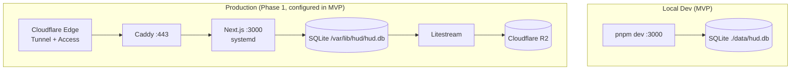

# HUD MVP — Foundation + Auth + Cashflow (Local-First)

## Context

Original Phase 0 (in `plan/HUD.md`) bundled a finance domain model, CSV import, MCP server, four agent skills, dashboard, Litestream replication, and Syncthing mobile sync into one MVP. That scope conflates "stand up the platform" with "deliver a domain". The platform work is invisible once done; the domain work is the visible payoff. Mixing them risks shipping neither.

This blueprint rescopes Phase 0 to **foundation + cashflow only**, **built locally first**, and pushes everything else (Hetzner deploy, MCP servers, agent skills, Syncthing) to later phases per the user instruction:

> "all effort for mvp will be building the foundation and structure then add the finance app… mvp is structure, authentication — we will have sign up and login, cloudflare and other frontfacing, Finance > cashflow page."

Two reference Figma screens are the source of truth for the UI:
- Login — Figma `node-id=305-2391` (screenshot reviewed in session)
- Finance / Cashflow — Figma `node-id=309-631` (screenshot reviewed in session)

Legacy data lives in `db backups/cashflow_export.csv` (~1k rows; columns `id,item,amount,currency,date,time,timezone,category,notes,created_at,updated_at`). It will be imported **after** the cloud deploy in Phase 1, not in MVP. The importer CLI is built in MVP and validated against the file locally, but the production load happens against the production DB.

## Strategic Objective

- **3 months (MVP exit):** Locally, `pnpm dev` brings up `localhost:3000`. A new install can sign up, log in, see an empty cashflow page styled exactly like the Figma, add a transaction via the `+` button, and see it render with cyan/green/red accents and Orbitron numerics. All production config (Caddy, cloudflared, CF Access, sops, Litestream, systemd) is committed and reviewable but not running.
- **12 months:** Same codebase has been promoted to Hetzner (Phase 1), Telegram bot is live (Phase 1), Obsidian mobile sync is live (Phase 2). The MVP foundation has not required a rewrite — only additions.
- **24 months:** The MVP repo layout, auth model, and design tokens are still the spine of the HUD. New modules (kanban, notes, agent chat) drop in as new routes under the same shell.

## Current State

- `plan/HUD.md` defines the 4-layer architecture (Edge / Gateways / Agents / Tools / Memory).
- `plan/reference/` has design docs for Caddy, Redis, secrets (sops+age), Sentry+Kuma. SQLite and HUD reference docs exist but are empty.
- `plan/blueprints/adr/ADR-26060501-vault-client-model.md` exists (not read in detail this session).
- `plan/blueprints/26060402-obsidian-iphone-sync-webdav.md` proposes Caddy WebDAV + Remotely Save for mobile vault sync — relevant to Phase 2, not MVP.
- `db backups/cashflow_export.csv` confirmed: ~14 KB, PHP currency, single-table transactions, free-text categories with some emoji (`🛌 Airbnb`, `Pet Food`, `Airbnb`), mixed time formats (`14:06`, `7:11PM`, `05:15pm`) requiring normalization.
- Figma design system (per `plan/reference/Finance.md`): shadcn Mira preset, Mist base/theme, Orbitron header, Oxanium body, small radius. Two screenshots reviewed confirm cyberpunk treatment (pure black, cyan accent, hazard stripes, grid overlay).
- No `package.json`, no `apps/` directory in `HUD/` yet — clean slate.
- User project pattern (from `~/CLAUDE.md`): Emily Web App uses Vite + React + Express + better-sqlite3 + shadcn. Paperclip uses pnpm monorepo + TypeScript.

## Proposed Approach

### High-level

A single Next.js (App Router) application with a colocated SQLite database, deployed locally as one process and to Hetzner behind Caddy + Cloudflare Tunnel. Next.js is preferred over Vite + Express because:

1. **One process behind Caddy.** One systemd unit, one health endpoint, one Sentry DSN, one log stream. Operational simplicity is the dominant constraint on a 2-core box.
2. **Server-first rendering** for the read-mostly cashflow page reduces client JS — important on iPhone 4G.
3. **Route handlers** replace Express. Fewer moving parts.
4. **shadcn/ui** documents Next.js as primary target; Tailwind v4 + Server Actions are first-class.
5. **Migrate path:** If Next.js becomes too heavy at Phase 4 (agent chat WS), the API surface can move to a separate Hono service without touching the UI.



### Stack

| Concern | Pick | Rationale |
|---|---|---|
| Runtime | Node.js 22 LTS | Boring, stable, matches user's other projects |
| Package manager | pnpm | Matches Paperclip; fast, deterministic |
| Framework | Next.js 15 (App Router) | One process, server components, route handlers |
| UI | React 19 + Tailwind v4 + shadcn/ui | Per `Finance.md` |
| Fonts | Orbitron (display/numerics), Oxanium (body) | Per `Finance.md` |
| DB | SQLite via `better-sqlite3` | Synchronous, single-file, fast |
| ORM | Drizzle | Type-safe SQL, lightweight, SQLite-first |
| Migrations | Drizzle Kit | Versioned, reviewable SQL |
| Auth | Custom (email + argon2id + server sessions) | No `next-auth` runtime — 4 endpoints, fully owned |
| Password hash | `@node-rs/argon2` | argon2id, memory=64MB, time=3 |
| Validation | Zod | Schema once, type + runtime |
| Forms | React Hook Form + Zod resolver | Standard |
| Rate limit | `rate-limiter-flexible` (memory store, Redis-ready) | Swap to Redis store in Phase 1 |
| Logging | Pino (JSON) | Structured, fast |
| Errors | Sentry | Per operational rule |
| Tests | Vitest | Matches Paperclip |
| Lint / format | Biome | One tool, fast |

### Repo layout

```
HUD/
├── plan/                            # vault (existing — do not edit from app)
├── db backups/                      # CSV legacy (existing)
├── apps/
│   └── web/                         # Next.js app
│       ├── app/
│       │   ├── (auth)/
│       │   │   ├── login/page.tsx
│       │   │   └── signup/page.tsx
│       │   ├── (app)/
│       │   │   ├── layout.tsx       # auth-gated shell, hamburger nav
│       │   │   └── finance/
│       │   │       ├── page.tsx     # redirects to /finance/cashflow
│       │   │       ├── cashflow/page.tsx
│       │   │       └── report/page.tsx     # stub for MVP
│       │   ├── api/
│       │   │   ├── auth/[login|signup|logout]/route.ts
│       │   │   └── transactions/route.ts
│       │   └── layout.tsx
│       ├── components/
│       │   ├── ui/                  # shadcn primitives
│       │   └── hud/                 # hud-specific (HazardStripe, GridOverlay, NumericDisplay, TabBar)
│       └── lib/
│           ├── auth/                # session, cookies, rate-limit, lockout
│           ├── db/                  # drizzle client
│           ├── money/               # minor-unit arithmetic + formatting
│           └── audit/               # audit log writer
├── packages/
│   └── db/
│       ├── schema.ts                # Drizzle schema (single source of truth)
│       ├── migrations/              # generated SQL
│       └── seed.ts
├── scripts/
│   └── import-cashflow.ts           # CLI: csv → transactions (Phase 1 use)
├── ops/                             # production config (committed, not deployed in MVP)
│   ├── caddy/Caddyfile
│   ├── cloudflared/config.yml
│   ├── systemd/hud-web.service
│   ├── litestream/litestream.yml
│   └── sops/.sops.yaml
├── data/                            # gitignored: ./data/hud.db (local dev only)
├── .env.example
├── package.json                     # pnpm workspace root
├── pnpm-workspace.yaml
└── README.md
```

### Database schema (MVP)

Stored in `packages/db/schema.ts`. Money is **integer minor units, signed** — never floats.

```sql
CREATE TABLE users (
  id              INTEGER PRIMARY KEY,
  email           TEXT NOT NULL UNIQUE,
  password_hash   TEXT NOT NULL,                    -- argon2id
  display_name    TEXT,
  failed_attempts INTEGER NOT NULL DEFAULT 0,
  locked_until    TEXT,
  created_at      TEXT NOT NULL DEFAULT (datetime('now')),
  updated_at      TEXT NOT NULL DEFAULT (datetime('now'))
);

CREATE TABLE sessions (
  id              TEXT PRIMARY KEY,                 -- hash of opaque cookie token
  user_id         INTEGER NOT NULL REFERENCES users(id) ON DELETE CASCADE,
  expires_at      TEXT NOT NULL,
  user_agent      TEXT,
  ip_address      TEXT,
  created_at      TEXT NOT NULL DEFAULT (datetime('now'))
);
CREATE INDEX idx_sessions_user ON sessions(user_id);

CREATE TABLE categories (
  id              INTEGER PRIMARY KEY,
  user_id         INTEGER NOT NULL REFERENCES users(id),
  name            TEXT NOT NULL,                    -- normalized, NO emoji
  kind            TEXT NOT NULL CHECK (kind IN ('expense','income','transfer')),
  created_at      TEXT NOT NULL DEFAULT (datetime('now')),
  UNIQUE(user_id, name)
);

CREATE TABLE transactions (
  id              INTEGER PRIMARY KEY,
  user_id         INTEGER NOT NULL REFERENCES users(id),
  item            TEXT NOT NULL,
  amount_minor    INTEGER NOT NULL,                 -- signed, centavos
  currency        TEXT NOT NULL DEFAULT 'PHP',
  occurred_at     TEXT NOT NULL,                    -- ISO-8601 with TZ offset
  category_id     INTEGER REFERENCES categories(id),
  notes           TEXT,
  source          TEXT NOT NULL DEFAULT 'manual',   -- 'manual' | 'csv-import' | 'agent'
  external_id     TEXT,                             -- legacy id for csv re-imports
  created_at      TEXT NOT NULL DEFAULT (datetime('now')),
  updated_at      TEXT NOT NULL DEFAULT (datetime('now'))
);
CREATE INDEX idx_tx_user_date ON transactions(user_id, occurred_at DESC);
CREATE INDEX idx_tx_user_cat  ON transactions(user_id, category_id);
CREATE UNIQUE INDEX idx_tx_external ON transactions(user_id, external_id)
  WHERE external_id IS NOT NULL;                    -- idempotent CSV import

CREATE TABLE audit_log (
  id              INTEGER PRIMARY KEY,
  user_id         INTEGER REFERENCES users(id),
  actor           TEXT NOT NULL,                    -- 'user' | 'agent:claude' | 'system'
  action          TEXT NOT NULL,                    -- 'create' | 'update' | 'delete' | 'login' | 'login_fail' | 'logout' | 'signup'
  entity          TEXT NOT NULL,                    -- 'transaction' | 'category' | 'user' | 'session'
  entity_id       TEXT,
  payload_json    TEXT,
  ip_address      TEXT,
  user_agent      TEXT,
  created_at      TEXT NOT NULL DEFAULT (datetime('now'))
);
CREATE INDEX idx_audit_user_time ON audit_log(user_id, created_at DESC);
```

### Authentication

App-level auth runs **in addition to** Cloudflare Access (which guards the domain in Phase 1+). This is deliberate defense in depth: CF Access protects the perimeter; app auth scopes per-user data and audit trail. Locally (no CF Access), app auth is the only gate.

**Sign-up.** Gated by env var `HUD_ALLOW_SIGNUP=true`. The first signup creates the owner account and (by default) the env flips to `false` for production. Locally, leave it true while iterating. Schema supports multi-user from day one — no migration later.

**Login.**
- Cookie: `__Host-hud_session`, `httpOnly`, `Secure` (in prod), `SameSite=Lax`, `Path=/`.
- Cookie value = opaque 256-bit token (base64url). Server stores `sha256(token)` as `sessions.id` — never the raw token. Compromise of the DB does not yield usable cookies.
- Session lifetime: 30 days, sliding (refresh on use).
- CSRF: SameSite=Lax + double-submit token on state-changing routes.
- Rate limit on `/api/auth/login`: 5 attempts / 15 min / IP, plus per-account counter.
- Lockout: 5 failed attempts on one account → `locked_until = now + 15min`. UI shows "Warning Attempts: 02" matching the Figma counter.

**Password.**
- argon2id, memory 64 MB, time cost 3, parallelism 1.
- Minimum 12 characters; no other rules (NIST 800-63B aligned).
- No password reset flow in MVP — single owner; recovery is a CLI script (`pnpm db:reset-password <email>`).

### Cyberpunk design system (shadcn extension)

Tailwind theme tokens (CSS variables, dark-only):

```css
:root {
  /* surfaces */
  --background:    0 0% 0%;           /* #000 */
  --surface:       210 30% 5%;        /* #0A0E12 card */
  --surface-2:     210 25% 8%;        /* #11151A elevated */
  --border:        215 16% 18%;       /* #262C33 thin lines */
  --grid:          215 16% 12% / 0.6; /* faint cross overlay */

  /* text */
  --foreground:    210 14% 91%;       /* #E6E8EB */
  --muted:         215 10% 50%;       /* #757B85 */

  /* semantic */
  --accent:        187 88% 42%;       /* #0FB8C9 cyan */
  --accent-fg:     210 30% 5%;
  --success:       142 71% 45%;       /* #22C55E */
  --destructive:   0 84% 60%;         /* #EF4444 */
  --warning:       38 92% 50%;        /* #F59E0B */
}
```

**Components (in `components/hud/`):**

| Component | Purpose |
|---|---|
| `GridOverlay` | Absolute-positioned faint cross-grid background (SVG, 32×32 cell, 1px stroke) |
| `HazardStripe` | Diagonal black-on-near-black stripe divider, used between hero card and transaction list |
| `NumericDisplay` | Orbitron, `tabular-nums`, supports large hero variant + delta badge (`+20% INC` cyan, `+20% inc` red) |
| `TabBar` | Underlined cyan active tab (Cashflow / Report) |
| `WarningCounter` | Large "02" Orbitron numeral with "Warning Attempts" label — login screen failed-attempt indicator |
| `TransactionRow` | Item (white) over `DATE | CATEGORY` (muted), amount right-aligned (green if positive, red if negative) |
| `Money` | Formats `amount_minor` + `currency` to `P125,999,597` (no decimals for >= 7 digits) or `P192,938.45` |

**Type scale:** display 96/72/48 (Orbitron 300), body 16/14/12 (Oxanium 400/500). Numbers always Orbitron + `tabular-nums` + `letter-spacing: 0.02em`.

**Radius:** `--radius: 2px` (sharp, near-zero per Figma).

### Cashflow page (`/finance/cashflow`)

Layout per Figma `node-id=309-631`:

```
┌─────────────────────────────────────┐
│ ☰              Finance              │   header (sticky)
├─────────────────────────────────────┤
│ Cashflow     Report                 │   tab bar, cyan underline on active
├─────────────────────────────────────┤
│                                     │
│  P125,999,597                       │   hero net-income card
│  Net Income  +20% INC               │
│                                     │
│ ┌────────────┬──────────────┐       │
│ │ P192,938.45│ P192,938.45  │       │   gross / expense sub-cards
│ │ Gross +5%  │ Expense +20% │       │
│ └────────────┴──────────────┘       │
│ ░░░░░░░░░░░░░░░░░░░░░░░░░           │   hazard stripe divider
│                                     │
│ TRANSACTIONS              [+]       │   list header + add button
│ ─────────────────────────────       │
│ Clean              -P280.00         │
│ JUN 24, 2026 │ Airbnb               │
│ ─────────────────────────────       │
│ Jeep               -P280.00         │
│ JUN 24, 2026 │ Transportation       │
│ …                                   │
└─────────────────────────────────────┘
```

**Aggregations (computed server-side per request):**
- `net_income` = `SUM(amount_minor)` over current period
- `gross` = `SUM(amount_minor) WHERE amount_minor > 0`
- `expense` = `SUM(-amount_minor) WHERE amount_minor < 0`
- Period selector defaults to **current month** (timezone from user prefs → fallback `Asia/Manila`)
- Delta = compared to previous month

Caching: page is a Server Component reading directly from SQLite (no HTTP roundtrip). No external cache needed at MVP scale.

### CSV importer (`scripts/import-cashflow.ts`)

CLI, run manually, **not invoked in MVP** but tested against the file. Production run happens in Phase 1 after cloud deploy.

Normalization rules:
- `id` → `external_id` (string)
- `amount` (float) → `amount_minor` = `Math.round(amount * 100)`
- `date` + `time` + `timezone` → ISO-8601 `occurred_at`; time parser accepts `14:06`, `7:11PM`, `05:15pm`, `7:40AM`
- `category`: strip leading emoji + whitespace (`🛌 Airbnb` → `Airbnb`), trim, title-case match against existing `categories.name` for the user; create if missing with `kind='expense'` by default
- Upsert by `(user_id, external_id)` for idempotency

### Production config (committed in MVP, deployed in Phase 1)

- `ops/caddy/Caddyfile` — based on `plan/reference/caddy.md`; reverse-proxies `hud.kevinaton.com` → `localhost:3000`
- `ops/cloudflared/config.yml` — tunnel to `hud.kevinaton.com`
- `ops/systemd/hud-web.service` — `ExecStart=/usr/bin/node apps/web/.next/standalone/server.js`, `EnvironmentFile=/var/lib/hud/.env`, `User=hud`, `ProtectSystem=strict`, `ReadWritePaths=/var/lib/hud`
- `ops/litestream/litestream.yml` — replicates `/var/lib/hud/hud.db` to R2 every 1s
- `ops/sops/.sops.yaml` — age key path config; encrypted `.env.enc` template

## Alternatives Considered

**A. Vite + React + Express + better-sqlite3** (matches Emily Web App)
- Pro: User already familiar; clean front/back split; faster local HMR; no Next.js bundle weight.
- Con: Two processes → two systemd units, two log streams, two health checks. CSRF + session cookie logic doubled (frontend + backend). Static asset serving needs Caddy rules.
- Rejected: operational overhead on a 2-core box outweighs the familiarity gain, and the Cashflow page is read-mostly server-rendered work that Next.js does better.

**B. SvelteKit + SQLite**
- Pro: Smaller client bundle, server-first idioms.
- Con: shadcn/ui ecosystem is React-first; user's other projects are React. Switching costs without offsetting benefit.
- Rejected.

**C. Postgres instead of SQLite**
- Pro: Concurrent writes, real types, mature backup tooling.
- Con: Another daemon, another backup pipeline, another set of credentials. SQLite + Litestream + WAL handles single-user write load at 10⁴× current scale. PostgreSQL is the right answer when there are multiple writers — not at MVP.
- Rejected; revisit at Phase 4 if agent write contention becomes a hotspot.

**D. NextAuth / Auth.js**
- Pro: Battle-tested, OAuth providers included.
- Con: Heavy runtime for what is effectively 4 endpoints + 1 cookie + 1 table. Hides session state in a way that complicates audit logging.
- Rejected. We own ~120 lines of auth code that is fully auditable.

## Security & Threat Model

### Trust boundaries

1. **Browser ↔ Next.js** (local: HTTP / prod: HTTPS via CF Tunnel)
2. **Next.js ↔ SQLite** (in-process; trust boundary only on filesystem perms)
3. **Next.js ↔ Sentry** (outbound HTTPS)
4. **Operator ↔ sops-encrypted secrets** (age key on disk)

### STRIDE

- **Spoofing.** Session cookie is opaque 256-bit random, only its `sha256` stored server-side. CF Access (Phase 1) adds SSO+MFA at the edge. *Residual:* stolen device with active cookie. Mitigation: short sliding session + per-session revocation in `sessions` table.
- **Tampering.** All write endpoints validate via Zod and require valid session + CSRF token. Money is integer; no float-rounding attack. Drizzle parameterizes all queries — no string-concatenated SQL.
- **Repudiation.** `audit_log` records every state-change with `actor`, `ip_address`, `user_agent`, `payload_json`. Append-only by convention; in Phase 1 add a SQLite trigger that forbids `UPDATE`/`DELETE`.
- **Information disclosure.** All routes under `(app)` enforce session check in `layout.tsx`. API routes call `requireSession()` at top. Error responses are generic — no stack traces to client. PII (email) never logged in plaintext; password never logged at all. Sentry scrubs request bodies on `/api/auth/*`.
- **Denial of service.** Rate limit on `/api/auth/login` (5 / 15min / IP). Account lockout caps brute force at 5 attempts per account. SQLite WAL handles read concurrency; writes serialized in app via a single `db.transaction()` helper.
- **Elevation of privilege.** Single-user MVP; `users.id` is the only authorization scope. Every query in `lib/db/` takes `userId` as a required param — enforced via TypeScript on the data layer. Sign-up gated by env var prevents drive-by account creation in prod.

### Controls (mapped)

| Threat | Control | Where |
|---|---|---|
| Cookie theft | `__Host-` prefix, httpOnly, Secure, SameSite=Lax | `lib/auth/cookie.ts` |
| Brute force | Rate limit + per-account lockout + audit | `lib/auth/login.ts` |
| SQL injection | Drizzle parameterized only | `lib/db/*` |
| XSS | React auto-escaping; no `dangerouslySetInnerHTML`; strict CSP header | `next.config.ts` + middleware |
| CSRF | Double-submit token on state-changing routes | `lib/auth/csrf.ts` |
| Password disclosure | argon2id; never logged; Sentry beforeSend scrub | `lib/auth/password.ts` |
| Session fixation | Rotate session ID on login | `lib/auth/login.ts` |
| Time-based account enum | Constant-time response on login fail (sleep to ~200ms) | `lib/auth/login.ts` |
| Money rounding | INTEGER minor units; never float at boundary | `lib/money/*` |
| Secret leak | sops + age; `.env*` gitignored; no secrets in client bundle | `ops/sops/`, `.gitignore` |
| Backup loss (Phase 1) | Litestream → R2 with 1s RPO | `ops/litestream/litestream.yml` |

### Residual risk

- **Local laptop compromise** during MVP — same blast radius as any local dev environment. Mitigation: keep `data/hud.db` out of cloud sync; use FileVault.
- **No 2FA at app level.** Acceptable for MVP because CF Access (Phase 1+) provides MFA at the edge. Add TOTP in Phase 1 if CF Access is disabled for any route.
- **No password reset flow** — single-user system, CLI-only reset. Documented.

## Risks & Mitigations

| Risk | Detection | Response |
|---|---|---|
| Schema change breaks legacy CSV import | Importer dry-run flag rejects unknown columns | Fix mapping; re-run with `--dry-run` before live |
| Money float crept in somewhere | Lint rule banning `number` in `transactions` insert; unit tests on `money/` | Fail CI; reject PR |
| Auth bypass via missing `requireSession` | Integration test asserts 401 on every `(app)/*` and `/api/*` (except auth) | Add to test suite as guard |
| shadcn theme drift from Figma | Storybook + visual snapshots of HUD components | Manual review at end of each phase |
| Local `data/hud.db` committed to git | `.gitignore` enforced; pre-commit hook for SQLite magic bytes | Add `lefthook` pre-commit |
| Phase 1 deploy fails because ops config rotted | `ops/` validated locally (caddy validate, cloudflared validate) in CI | CI job runs validators on every PR |

## Phased Implementation

Each sub-phase is independently shippable to `main` and demoable locally.

| Phase | Outcome | Depends on | Effort | Exit criteria |
|-------|---------|------------|--------|---------------|
| 0.1 — Scaffold | pnpm workspace, Next.js 15 app boots, Tailwind v4 + shadcn init, Orbitron+Oxanium loaded, Biome + Vitest configured | — | S (1 day) | `pnpm dev` shows a black page with "HUD" in Orbitron at `localhost:3000`; lint + test commands pass |
| 0.2 — Design system | `components/hud/*` built (GridOverlay, HazardStripe, NumericDisplay, TabBar, WarningCounter, Money); theme tokens set; Storybook entries | 0.1 | M (2 days) | Storybook (or `/dev/preview` route) renders all hud components matching Figma to eye |
| 0.3 — Database | Drizzle schema, migrations, seed; `pnpm db:migrate`, `pnpm db:seed`, `pnpm db:studio` work; `lib/money` + unit tests | 0.1 | S (1 day) | Migrations apply cleanly; seed creates one user + 5 categories + 3 transactions; `db:studio` opens |
| 0.4 — Auth | Sign-up (env-gated), login, logout, session, CSRF, rate limit, lockout, audit log writes; login page matches Figma incl. Warning Attempts counter | 0.2, 0.3 | M (3 days) | Can sign up once (with `HUD_ALLOW_SIGNUP=true`), log in, log out; 6th failed login locks account for 15 min; `audit_log` shows every event |
| 0.5 — Cashflow read | `/finance/cashflow` Server Component renders hero card, gross/expense sub-cards, transaction list from DB; matches Figma | 0.2, 0.3, 0.4 | M (2 days) | Logged-in user sees seeded transactions styled per Figma; gross/expense/net aggregations correct; deltas vs prev month correct |
| 0.6 — Cashflow write | `+` button opens modal; React Hook Form + Zod; POST `/api/transactions`; audit log entry; optimistic UI | 0.5 | S (1 day) | New transaction appears in list; refresh persists; audit log has matching `create` row |
| 0.7 — CSV importer | `pnpm import:cashflow <csv>` CLI; emoji-strip; time normalize; upsert by `external_id`; `--dry-run` mode | 0.3 | S (1 day) | Dry-run against `db backups/cashflow_export.csv` reports row counts, normalized categories, parse failures; live run inserts idempotently |
| 0.8 — Production config (committed, not deployed) | `ops/caddy`, `ops/cloudflared`, `ops/systemd`, `ops/litestream`, `ops/sops`; `.env.example`; README runbook section | 0.1 | S (1 day) | `caddy validate ops/caddy/Caddyfile` passes; `cloudflared tunnel ingress validate` passes; runbook reviewed |

**Total MVP effort: ~11 person-days** of focused work.

## Success Criteria

- `pnpm dev` → sign up → log in → view styled empty Cashflow page → add a transaction → see it rendered with correct cyan/green/red — all working locally on macOS without internet.
- `pnpm test` passes; coverage on `lib/auth`, `lib/money`, `lib/db` ≥ 80%.
- `pnpm import:cashflow --dry-run db\ backups/cashflow_export.csv` reports zero parse failures and zero emoji surviving normalization.
- Visual comparison of `/login` and `/finance/cashflow` against the two Figma screenshots: layout, type, color, spacing match to eye.
- `git grep -nE 'float|Number\(.*amount'` returns nothing under `apps/` or `packages/db/` (money invariant).
- Every successful login, failed login, transaction create has exactly one corresponding row in `audit_log`.
- `ops/caddy/Caddyfile` and `ops/cloudflared/config.yml` validate with their respective CLIs.
- Phase 1 deploy plan is a separate blueprint; this one is "done" without ever touching Hetzner.

## Open Questions

- **OQ-1.** Does the user want the "+" add button to open a modal (proposed) or navigate to a `/finance/cashflow/new` page? Modal is faster for the cashflow use case; page is friendlier on mobile.
- **OQ-2.** Period selector on Cashflow page: month-only (proposed) or also week/quarter/year? Figma shows no selector — defaulting to current month.
- **OQ-3.** Currency: PHP-only (proposed) or multi-currency at MVP? Schema supports multi; UI assumes single. Multi-currency display adds non-trivial work.
- **OQ-4.** Should sign-up be exposed on the `/login` screen (proposed: yes, only if `HUD_ALLOW_SIGNUP=true`) or hidden behind a separate URL only the operator knows?
- **OQ-5.** Sentry DSN for local dev — use a personal Sentry project, or no-op (proposed) until Phase 1?
- **OQ-6.** Confirm Next.js 15 (App Router) over the user's existing Vite+Express pattern. If the user prefers continuity with `emily-web-app`, swap to that stack and re-cost.
- **OQ-7.** Figma URLs are auth-gated; the two screenshots are the source of truth. Are there additional screens (e.g., Report tab, transaction detail, sign-up) the user expects in MVP that weren't shared?

## Debt Incurred

None at this layer. MVP is intentionally a smaller surface than the original Phase 0; the deferred items (Hetzner deploy, MCP servers, agent skills, Syncthing, Telegram) move to their natural phases in `plan/HUD.md` rather than being deferred as debt.

## Tasks

To be generated after Open Questions are answered. Likely set:
- `T-26060501-scaffold-monorepo`
- `T-26060502-design-tokens-and-hud-components`
- `T-26060503-db-schema-and-migrations`
- `T-26060504-auth-signup-login-session`
- `T-26060505-cashflow-page-read`
- `T-26060506-cashflow-add-transaction`
- `T-26060507-csv-importer-cli`
- `T-26060508-production-config-artifacts`
