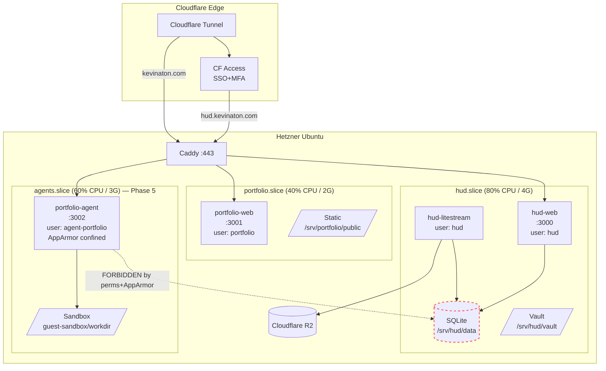

# Multi-Tenant Server Layout — HUD + Portfolio on One Hetzner Box, Agent-Navigable

## Context

A single Hetzner CCX13 (2-core, Ubuntu LTS) will host **two distinct tenants**:

- **HUD** — private personal command center (finance, agents, dashboard, vault). High-trust. Owner-only access via Cloudflare Access SSO+MFA.
- **Portfolio** — public-facing site at `kevinaton.com`, including a future guest agent (Phase 5) that anonymous visitors can talk to. **Untrusted** — every byte that reaches Portfolio could be hostile.

The same server will also host **AI agents** (Claude CLI, Gemini CLI, Opencode CLI) that operate as a long-lived environment — they read files, run scripts, write notes. Agents are first-class operators, not occasional scripts.

This combination creates three competing pressures:

1. **Isolation.** A compromised Portfolio guest agent must not exfiltrate HUD finance data. A buggy HUD agent must not deface the portfolio.
2. **Discoverability.** Agents need a predictable, self-describing layout. "Where does Portfolio store its logs?" must have one answer, findable from a known starting point, without trial and error.
3. **Operational simplicity.** One Caddy, one Cloudflare Tunnel, one Litestream daemon-per-DB, one observability stack. We are not building a PaaS.

This blueprint defines a layout that satisfies all three.

It also surfaces a strategic contradiction with `plan/HUD.md`:
- Layer 1 says: *"Portfolio — hosted separately, out of scope"*
- Phase 5 says: *"Portfolio guest agent (separate hosting)"*

The user's stated direction in this session — co-locate Portfolio on the HUD box — overrides both. The strategy doc should be updated once OQ-1 is resolved.

## Strategic Objective

- **3 months:** HUD MVP (per `26060502`) deploys to `/srv/hud/`. Portfolio (current static site at minimum) deploys to `/srv/portfolio/`. Two tenants, zero shared writable paths. An AI agent SSHed in as the operator can `cat /etc/hud/server-map.md` and discover every running service, its owner, its port, its log path, and its allowed operations — in under 10 seconds.
- **12 months:** Portfolio guest agent (Phase 5) is running in a hardened sandbox (`portfolio-agent` user, AppArmor profile, no network egress except via allowlist). It cannot read `/srv/hud/`. Verified by a periodic red-team script.
- **24 months:** Adding a third tenant (e.g. `cashflow-public`, `blog`) takes one provisioning script and ~30 minutes. The layout has not been refactored.

## Current State

- **Server:** not yet provisioned. Hetzner CCX13, Ubuntu LTS planned.
- **HUD repo:** `~/Documents/Project/HUD/` locally, no `apps/` yet (per `26060502` MVP is being built local-first).
- **Portfolio repo:** not read in this session. *Assumed (not verified):* exists somewhere under `~/Documents/Project/`. I have not read its build artifacts or stack.
- **No existing user accounts, systemd units, or filesystem conventions** to preserve. Greenfield.
- **Reference docs reviewed this session:** `plan/reference/caddy.md`, `plan/reference/secrets.md`.
- **Tenant trust asymmetry:** HUD is single-operator (Kevin). Portfolio's guest agent will eventually expose an LLM tool surface to the public Internet — the highest-risk component on the box.

## Proposed Approach

### 1. Tenant model — Unix users + systemd slices

Every tenant gets:

- A **system user** (`hud`, `portfolio`) owning the tenant root.
- A **system group** (`hud`, `portfolio`) for shared access within the tenant.
- A **systemd slice** (`hud.slice`, `portfolio.slice`) for cgroup-level CPU/memory limits.
- An **agent user** (`agent-hud`, `agent-portfolio`) for AI-driven processes within the tenant — same group as the tenant, but separate UID for blast-radius containment and audit.
- A **filesystem root** at `/srv/<tenant>/` with mode `750 <tenant>:<tenant>` — neither world-readable nor cross-tenant readable.

```
/etc/passwd (relevant entries)
hud:x:2001:2001:HUD tenant:/srv/hud:/bin/bash
portfolio:x:2002:2002:Portfolio tenant:/srv/portfolio:/bin/bash
agent-hud:x:2011:2001:HUD AI agents:/srv/hud:/bin/bash
agent-portfolio:x:2012:2002:Portfolio AI agents:/srv/portfolio:/usr/sbin/nologin
caddy:x:998:998:Caddy:/var/lib/caddy:/usr/sbin/nologin
cloudflared:x:997:997:Cloudflared:/nonexistent:/usr/sbin/nologin
```

**Key rule:** `agent-portfolio` has `nologin` and runs only as a managed systemd service (Phase 5). It is never SSH-accessible. `agent-hud` is interactive — Kevin (or a Claude CLI session as Kevin) shells in and works there.

### 2. Filesystem layout

```
/srv/
├── hud/                          # 750 hud:hud
│   ├── CLAUDE.md                 #   tenant invariants — agents read first
│   ├── README.md                 #   human-facing tenant map
│   ├── app/                      #   git checkout of HUD repo
│   │   ├── apps/web/             #     Next.js app (per 26060502)
│   │   ├── packages/db/
│   │   └── …
│   ├── data/                     # 700 hud:hud — DB, indexes
│   │   ├── hud.db                #     SQLite
│   │   └── hud.db-wal
│   ├── secrets/                  # 700 hud:hud — age key + sops-decrypted .env at runtime
│   │   ├── age.key               #     600 hud:hud
│   │   └── .env                  #     600 hud:hud (decrypted by systemd unit)
│   ├── logs/                     # 750 hud:hud — pino JSON logs
│   ├── runtime/                  # 700 hud:hud — PID files, unix sockets
│   ├── vault/                    # 750 hud:hud — Obsidian vault (Phase 2)
│   └── backups/                  # 700 hud:hud — Litestream metadata
│
├── portfolio/                    # 750 portfolio:portfolio
│   ├── CLAUDE.md
│   ├── README.md
│   ├── app/                      #   git checkout of Portfolio repo
│   ├── data/                     #   portfolio.db if/when needed
│   ├── secrets/
│   ├── logs/
│   ├── runtime/
│   ├── public/                   # 755 portfolio:caddy — Caddy reads static here
│   └── guest-sandbox/            # 770 portfolio:agent-portfolio (Phase 5)
│       └── workdir/              #   guest agent's only writable area
│
└── shared/                       # 755 root:root — cross-tenant infra config (read-only to tenants)
    ├── caddy/
    │   └── Caddyfile             # 644 root:caddy
    ├── cloudflared/
    │   └── config.yml            # 644 root:cloudflared
    └── observability/
        ├── sentry/               # DSN registry
        └── uptime-kuma/

/opt/agents/                       # 755 root:agents — shared CLI binaries
├── claude/                        #   `claude` CLI install
├── gemini/
├── opencode/
└── bin/                           # symlinks in PATH

/etc/hud/                          # 755 root:root — server-wide config
├── server-map.md                  # 644 — THE map; first thing every agent reads
├── tenants/
│   ├── hud.yml                    #   declarative tenant metadata
│   └── portfolio.yml
└── policies/
    ├── apparmor/                  #   AppArmor profiles per tenant
    └── sudoers.d/                 #   restricted sudo rules

/var/lib/litestream/               # 700 root:root — per-DB replication state
├── hud/
└── portfolio/

/var/log/journal/                  # journald — per-unit logs already isolated
```

**Invariants enforced by permissions:**

- `hud` cannot read `/srv/portfolio/` (mode 750, different group).
- `portfolio` cannot read `/srv/hud/`.
- `caddy` can read `/srv/portfolio/public/` (group membership) and nothing else under any tenant.
- `agent-portfolio` (Phase 5) is confined to `/srv/portfolio/guest-sandbox/workdir/` for writes (AppArmor + systemd `ReadWritePaths`).
- Everything under `/srv/*/secrets/` is `700` owner-only.

### 3. systemd structure

```
slices:
  hud.slice              CPUQuota=80%   MemoryMax=4G
  portfolio.slice        CPUQuota=40%   MemoryMax=2G
  agents.slice           CPUQuota=60%   MemoryMax=3G

units:
  hud-web.service        Slice=hud.slice         User=hud         Group=hud
  hud-litestream.service Slice=hud.slice         User=hud         Group=hud
  portfolio-web.service  Slice=portfolio.slice   User=portfolio   Group=portfolio
  caddy.service          (system)                User=caddy
  cloudflared.service    (system)                User=cloudflared
  # Phase 5:
  portfolio-agent.service Slice=agents.slice     User=agent-portfolio  Group=portfolio
                          AppArmorProfile=portfolio-agent
                          ReadWritePaths=/srv/portfolio/guest-sandbox/workdir
                          ProtectSystem=strict  ProtectHome=true
                          NoNewPrivileges=true  PrivateTmp=true
                          RestrictAddressFamilies=AF_INET AF_INET6 AF_UNIX
                          SystemCallFilter=@system-service
                          NetworkNamespace=… (Phase 5 detail)
```

CPU + memory quotas at the slice level prevent a runaway tenant from starving the other. The 80/40/60 split sums to 180% on a 2-core box because slices are caps, not reservations — under contention the kernel enforces fair share within the cap.

### 4. Cloudflare + Caddy ingress

One Cloudflare Tunnel, one Caddy, separate routes:

```
Cloudflare Tunnel
├── hud.kevinaton.com         → CF Access (SSO + MFA) → Caddy :443 → 127.0.0.1:3000 (hud-web)
├── ssh.hud.kevinaton.com     → CF Access (SSO + MFA) → cloudflared SSH ingress → sshd :22 (localhost-only)
├── kevinaton.com             → Caddy → static 404 (Plan A: Cloudflare Pages owns this domain)
└── www.kevinaton.com         → Caddy → static 404
    # Plan B (deferred): kevinaton.com → 127.0.0.1:3001 (portfolio-web)
    # Plan B (deferred): /agent → 127.0.0.1:3002 (portfolio-agent, rate-limited, anonymous)
```

CF Access enforced at the edge for `hud.kevinaton.com`. Portfolio is public; `/agent` endpoint adds rate limiting + bot protection at the edge.

Caddyfile lives at `/srv/shared/caddy/Caddyfile`; tenants cannot modify it (root-owned, group-readable for caddy).

### 5. Agent navigation — the map and the conventions

Two mechanisms make the server self-describing:

**(a) `/etc/hud/server-map.md`** — single canonical document. Agents read it as their first action in any session. Example:

```markdown
# Server Map — HUD + Portfolio

Last updated: 2026-06-05

## Tenants

### hud
- Root:    /srv/hud
- Owner:   hud:hud (UID 2001)
- Agents:  agent-hud (UID 2011, interactive)
- Slice:   hud.slice (80% CPU, 4G RAM)
- Web:     hud-web.service on 127.0.0.1:3000
- DB:      /srv/hud/data/hud.db (SQLite + Litestream → R2)
- Vault:   /srv/hud/vault (Phase 2)
- Logs:    /srv/hud/logs/ + journalctl -u hud-web
- Domain:  hud.kevinaton.com (CF Access required)
- Read   : agent-hud may read everything under /srv/hud
- Write  : agent-hud may write under /srv/hud/{vault,data}/...
- Forbid : agent-hud must not read /srv/portfolio (perms enforce)

### portfolio
- Root:    /srv/portfolio
- Owner:   portfolio:portfolio (UID 2002)
- Agents:  agent-portfolio (UID 2012, sandboxed, no-shell) — Phase 5
- Slice:   portfolio.slice (40% CPU, 2G RAM)
- Web:     portfolio-web.service on 127.0.0.1:3001
- Static:  /srv/portfolio/public/ (Caddy reads)
- Domain:  kevinaton.com (public)

## Shared
- Caddy:        /srv/shared/caddy/Caddyfile (root-owned)
- Cloudflared:  /srv/shared/cloudflared/config.yml
- Agents CLIs:  /opt/agents/bin/{claude,gemini,opencode}
- Litestream:   /var/lib/litestream/<tenant>/

## Operational conventions
- Every tenant has the same subdir shape: app/ data/ secrets/ logs/ runtime/
- Logs are JSON (pino), one line per event, stdout → journald
- Secrets are sops-encrypted in git, decrypted to /srv/<tenant>/secrets/.env at boot
- Never write outside your tenant root. Use `hud-where <tenant>` to find paths.

## Discovery commands
- hud-where <tenant>          # prints tenant paths
- hud-status                  # systemctl status of all hud-*/portfolio-* units
- hud-tail <tenant>           # journalctl -fu <tenant>-web
- hud-map                     # opens this file in $PAGER
```

**(b) Per-tenant `CLAUDE.md`** at `/srv/<tenant>/CLAUDE.md`. Contains tenant-specific invariants the agent must respect — analogous to the user's `~/CLAUDE.md` but scoped to that tenant. Example for HUD:

```markdown
# HUD Tenant — Agent Invariants

You are operating inside the HUD tenant. Stay inside /srv/hud.

## Hard rules
- DB writes go through the app's data layer (apps/web/lib/db), never raw sqlite3.
- Every state-changing action must produce an audit_log entry.
- Money is INTEGER minor units. Never floats.
- Vault edits respect the architect's vault rules (see /srv/hud/vault/CLAUDE.md).
- Do not run package installers in production — only the operator does that.

## Common paths
- App:     /srv/hud/app
- DB:      /srv/hud/data/hud.db
- Logs:    /srv/hud/logs/  (or `journalctl -u hud-web`)
- Vault:   /srv/hud/vault
- Secrets: NEVER read /srv/hud/secrets/.env directly — services already have them

## Common commands
- pnpm --filter web dev        # local-style dev (not in prod)
- systemctl status hud-web
- sqlite3 /srv/hud/data/hud.db "select count(*) from transactions"
```

**(c) Discovery scripts in `/opt/agents/bin/`** — small, no-arg shell scripts:

| Command | Action |
|---|---|
| `hud-map` | `$PAGER /etc/hud/server-map.md` |
| `hud-where <tenant>` | Echoes paths for the named tenant |
| `hud-status` | `systemctl --no-pager status hud-*.service portfolio-*.service` |
| `hud-tail <tenant>` | `journalctl -fu ${tenant}-web` |
| `hud-tenants` | `ls /etc/hud/tenants/` |
| `agent-claude` | `sudo -u agent-hud -E claude` (operator-typed → agent-identity invocation) |
| `agent-gemini` | `sudo -u agent-hud -E gemini` |
| `agent-opencode` | `sudo -u agent-hud -E opencode` |

**Why agent wrappers (per OQ-5 decision):** Interactive shell stays as `kevin` so SSH session, history, and editor state belong to the operator. The moment Kevin invokes an agent CLI, it runs as `agent-hud` — a distinct UID with its own audit trail. The `hud.audit_log` table records `actor='agent:claude'` (not `actor='user'`) for every state change, making it forensically obvious whether a transaction was typed by Kevin or written by an LLM tool call. Sudoers entry: `kevin ALL=(agent-hud) NOPASSWD: /opt/agents/bin/*` — Kevin can become `agent-hud` only via the wrapper binaries, nothing else.

These scripts are stable interfaces. Agents and the operator both use them. Underlying paths can change; the scripts cannot break.

### 6. Tenant manifest — declarative metadata

`/etc/hud/tenants/<tenant>.yml` is the machine-readable source of truth:

```yaml
# /etc/hud/tenants/hud.yml
name: hud
description: Personal HUD — finance, agents, dashboard
owner_user: hud
owner_group: hud
agent_user: agent-hud
slice: hud.slice
root: /srv/hud
domain: hud.kevinaton.com
public: false
auth: cloudflare-access
upstream: 127.0.0.1:3000
db:
  engine: sqlite
  path: /srv/hud/data/hud.db
  replication: litestream
  destination: r2://hud-litestream
services:
  - hud-web.service
  - hud-litestream.service
trust_level: high
```

The `hud-map` and `hud-where` scripts read these YAML files — no hand-edited copy/paste between the map and reality.

### 7. Architecture diagram



## Alternatives Considered

**A. Single-user, single-tree (`/home/kevin/{hud,portfolio}`).** Simplest.
- Pro: No user provisioning, no perms gymnastics.
- Con: Zero isolation. A bug or exploit in Portfolio (public-facing!) reads the finance DB. Unacceptable given Portfolio will host a public LLM endpoint in Phase 5.
- **Rejected** on security grounds.

**B. Docker / Compose per tenant.** Container isolation, conventional.
- Pro: Strong-ish isolation, image versioning, easy rollback.
- Con: Daemon overhead on a 2-core box, image build pipeline, networking complexity, harder for agents to "roam" — they'd need to `docker exec` everywhere. Logs, secrets, and DB volumes still need host-side conventions, so we'd be solving the same layout problem one layer down.
- **Rejected for HUD/Portfolio web tier.** Reconsider specifically for `portfolio-agent` (Phase 5) — see option C.

**C. Rootless Podman for the public-facing guest agent only.** Hybrid.
- Pro: Strong sandbox where it matters most (Internet-facing LLM tool). Bare-metal simplicity where it doesn't (private HUD).
- Con: Operator learns two patterns.
- **Accepted as Phase 5 option.** AppArmor + systemd hardening is the default; Podman is the fallback if AppArmor proves insufficient under red-team testing.

**D. NixOS or systemd-nspawn containers.** Declarative.
- Pro: Reproducible, immutable infrastructure.
- Con: Massive jump in operator skill curve. Outside the "boring technology" rule.
- **Rejected.**

**E. Kubernetes (k3s).** Industry default.
- Pro: Real isolation, real quotas, real declarative state.
- Con: For two tenants on one 2-core VM, this is malpractice. The control plane alone would eat a core.
- **Rejected.**

**F. Per-tenant VM (two Hetzner boxes).** Maximum isolation.
- Pro: Hardware-level isolation; tenant compromise is fully contained.
- Con: Doubles cost and ops burden. The threat model doesn't justify it — AppArmor + Unix perms + systemd hardening yields ~99% of the isolation at 1× the cost.
- **Rejected**, but noted as the escape hatch if Portfolio ever hosts something genuinely high-risk (e.g. user uploads, third-party code execution).

## Security & Threat Model

### Trust boundaries (in order of decreasing trust)

1. **Operator (Kevin) via SSH + key auth** — fully trusted on host.
2. **HUD app + agent-hud** — trusted within `/srv/hud/`.
3. **Portfolio app** — trusted within `/srv/portfolio/`. Public reach via HTTP, narrow attack surface (static + minimal API).
4. **portfolio-agent (Phase 5)** — *untrusted by design.* Any input could be adversarial (prompt injection). Treat as hostile.
5. **Internet at large** — fully untrusted.

### STRIDE

- **Spoofing.**
  - SSH: key-only (`PasswordAuthentication no`, `PermitRootLogin no`), MFA via hardware key.
  - HUD: CF Access SSO+MFA at the edge + app-level session (per `26060502`).
  - Portfolio agent: no identity; rate-limited per IP at CF + per-session at app.
- **Tampering.**
  - Tenant roots `750`, secrets `700`. Cross-tenant write is impossible at the FS layer.
  - `systemd ProtectSystem=strict ProtectHome=true ReadWritePaths=…` limits each unit to its declared writable paths.
  - Caddyfile, cloudflared config, AppArmor profiles all root-owned; tenants cannot modify ingress or policy.
- **Repudiation.**
  - All shells log to `auditd` (Phase 1 add); journald captures all unit stdout/stderr per-unit, per-user, immutable for the journal lifetime.
  - HUD app writes its own `audit_log` (per `26060502`).
  - portfolio-agent logs every tool call to `/srv/portfolio/logs/agent.jsonl` with prompt + response + tool args.
- **Information disclosure.**
  - Cross-tenant: Unix perms (defense 1) + AppArmor (defense 2) + systemd `PrivateTmp` + cgroup `ProtectHome`.
  - Secrets: never in git plaintext (sops + age, per `plan/reference/secrets.md`). Decrypted `.env` lives in `/srv/<tenant>/secrets/.env` mode `600`, loaded by systemd `EnvironmentFile`. Never logged.
  - Agent prompt exfiltration (Phase 5): portfolio-agent has no read access to HUD; even if a visitor jailbreaks it, the worst case is a Portfolio-scoped data read (and Portfolio holds no PII at MVP).
- **Denial of service.**
  - Per-slice CPU/memory caps prevent one tenant from starving the other.
  - portfolio-agent (Phase 5) gets the strictest cap + CF rate limit + Caddy `rate_limit` directive + per-session token budget.
  - Caddy and cloudflared run as system services in their own slice (`system.slice`); their failure is global, but they're well-vetted binaries with no tenant code.
- **Elevation of privilege.**
  - No tenant user has sudo by default. `/etc/sudoers.d/hud-operator` grants the operator (`kevin`) restricted sudo (`systemctl restart hud-*`, `journalctl`, `litestream restore`). No tenant user is in `sudo`.
  - `NoNewPrivileges=true` on every tenant systemd unit — setuid binaries cannot elevate.
  - Agent users (`agent-hud`, `agent-portfolio`) explicitly excluded from any sudoers entry.

### Controls (mapped to threats)

| Threat | Control | Layer |
|---|---|---|
| Cross-tenant read | `750` mode + separate UID/GID | Filesystem |
| Cross-tenant read | AppArmor profile per tenant | LSM |
| Cross-tenant read | systemd `ReadWritePaths` + `InaccessiblePaths` | systemd |
| Container/unit escape | `NoNewPrivileges`, `ProtectSystem=strict`, `RestrictNamespaces`, `SystemCallFilter=@system-service` | systemd hardening |
| Resource exhaustion | systemd slices with `CPUQuota` + `MemoryMax` | cgroup v2 |
| Public agent abuse | CF rate limit + Caddy `rate_limit` + per-session token budget | Edge + app |
| Public agent egress | Egress allowlist via nftables in agent's netns | Network |
| Secret leak in logs | Pino redaction rules; Sentry beforeSend scrub | App |
| SSH brute force | Key-only auth; `fail2ban`; CF Tunnel as primary path (no public SSH if possible) | Edge + host |
| Audit gap | auditd + journald + per-tenant `audit_log` table | OS + app |
| Time-based attacks across tenants | Each tenant has its own session secret; constant-time compare | App |

### Residual risk

- **Kernel exploit** breaking AppArmor / namespaces — host-level patches via unattended-upgrades; monitor CVE feeds.
- **Operator account compromise** (Kevin's SSH key) — full server access. Mitigation: hardware key + offline backup key in a sealed envelope.
- **Cloudflare account compromise** — all routing and Access policies flip. Mitigation: enforce hardware-key 2FA on Cloudflare; account audit log review monthly.
- **Supply-chain compromise of agent CLIs** (`/opt/agents/`) — agent CLIs have read access to anything their invoking user has. Mitigation: pin versions, verify checksums, review release notes.

## Risks & Mitigations

| Risk | Detection | Response |
|---|---|---|
| Agent writes outside its tenant | AppArmor denial in journald + `auditd` alert | Auto-page; review prompt; revoke session |
| Slice cap starves HUD during Portfolio spike | `systemd-cgtop` metrics scraped by Uptime Kuma | Adjust slice quotas; review Portfolio load |
| Server-map drifts from reality | Cron job diffs `/etc/hud/tenants/*.yml` against `systemctl list-units` | Fail loudly; operator updates manifest |
| Secrets accidentally committed | `gitleaks` pre-commit + CI scan | Reject; rotate the leaked credential immediately |
| portfolio-agent escapes sandbox (Phase 5) | AppArmor denials, unusual syscalls, egress to non-allowlisted IPs | Kill unit; investigate; if real, migrate agent to Podman + netns |
| Tenant fills disk | `df` thresholds via Uptime Kuma; per-tenant `quotacheck` | Operator triage; per-tenant disk quotas as escalation |
| Two tenants accidentally share a port | Caddyfile linter + tenant manifest validation in CI | CI fail before deploy |

## Phased Implementation

| Phase | Outcome | Depends on | Effort | Exit criteria |
|-------|---------|------------|--------|---------------|
| L0 — Provisioning script | Idempotent bash/Ansible script that creates users, groups, slices, dirs, perms, sudoers, base packages | — | M (2 days) | Run on a fresh Hetzner image → reaches defined state; re-run is a no-op |
| L1 — Tenant manifest + map | `/etc/hud/tenants/*.yml`, `/etc/hud/server-map.md`, `/opt/agents/bin/hud-*` scripts | L0 | S (1 day) | `hud-map`, `hud-where hud`, `hud-where portfolio`, `hud-status` all work |
| L2 — HUD deploy | `hud-web.service` running per `26060502` MVP; CF Tunnel route; CF Access policy; Litestream replicating | L0, L1, MVP from `26060502` | M (2 days) | `hud.kevinaton.com` resolves, prompts CF Access, serves the app; Litestream backup verified by restore drill |
| L3 — Portfolio deploy *(deferred — Plan B only)* | `portfolio-web.service` running; CF Tunnel route; static + minimal SSR | L0, L1, Portfolio repo exists | M (2 days) | `kevinaton.com` serves the portfolio publicly |
| L4 — Hardening pass | AppArmor profiles applied, sudoers restricted, fail2ban, unattended-upgrades, auditd | L2 (L3 not required) | M (2 days) | `aa-status` shows enforce mode; sudo -l for tenant users returns nothing; auditd reports recent events |
| L5 — Portfolio guest agent *(deferred — Plan B only)* | `portfolio-agent.service` with AppArmor + egress allowlist + per-session token budget | L4, L3 | L (5 days) | Red-team script (`tools/redteam-portfolio.sh`) cannot read `/srv/hud`, cannot escape sandbox, gets rate-limited correctly |

## Success Criteria

- A fresh Hetzner image runs the L0 provisioning script and reaches the documented state with zero manual steps.
- `cat /etc/hud/server-map.md && hud-status` gives a complete operational picture in under 10 seconds.
- An AI agent SSHed in as `kevin` can answer "where does HUD store its database?" by running `hud-where hud` and parsing the output — no guessing, no `find /` walks.
- `sudo -u portfolio cat /srv/hud/data/hud.db` returns `Permission denied`.
- `sudo -u agent-portfolio cat /srv/hud/data/hud.db` returns `Permission denied` (Phase 5 verification).
- `systemd-cgtop` shows HUD and Portfolio bounded by their slice limits under synthetic load.
- All four service units (`hud-web`, `hud-litestream`, `portfolio-web`, `caddy`) report `active (running)` after a reboot, with no manual intervention.
- Litestream restore drill: kill `/srv/hud/data/hud.db`, restore from R2, app comes back identical.
- AppArmor `aa-status` reports profiles in **enforce** mode for `portfolio-agent` (Phase 5).
- Red-team script for Phase 5 fails to escalate, escape, or cross-read.

## Open Questions — Resolved 2026-06-05

- **OQ-1. Update `HUD.md` strategy?**
  - **Decision:** No. Portfolio stays "Plan A: Cloudflare Pages / separate hosting" in the strategy doc. This blueprint pre-structures the Hetzner server so Portfolio **can** be added later as Plan B without re-paving. `HUD.md` Phase 5 wording stays as-is.
- **OQ-2. Where is the Portfolio repo today?**
  - **Decision:** Does not exist yet. Portfolio is the next project after HUD. The Hetzner layout reserves `/srv/portfolio/` and provisions the user/group/slice at L0, but `portfolio-web.service` is not built or deployed. Phase L3 in this blueprint is marked **deferred-indefinitely**.
- **OQ-3. Domain layout.**
  - **Decision:** Portfolio will eventually use `kevinaton.com` and/or `www.kevinaton.com`. **Until then**, both serve a static 404 from Caddy (no upstream). HUD remains at `hud.kevinaton.com`. Caddyfile reflects this from L1 onward.
- **OQ-4. SSH posture.**
  - **Decision:** SSH-over-Cloudflare-Tunnel (zero public ports). Operator SSHes from a normal terminal via `cloudflared access ssh` as a `ProxyCommand` in `~/.ssh/config`. CF Access enforces MFA at session start; JWT cached locally, auto-refreshed. Public port 22 is **closed**. `mosh` also works over a CF TCP tunnel if needed.
- **OQ-5. Agent CLI identity at runtime.**
  - **Decision:** Option 1 — `sudo -u agent-hud claude` (or wrapper `agent-claude`, `agent-gemini`, `agent-opencode` in `/opt/agents/bin/`). Operator's interactive shell remains `kevin`; agent invocations run as `agent-hud` and write to the audit log under that identity. Clear separation of "operator typed" vs "agent did".
- **OQ-6. Resource quotas.**
  - **Decision:** 80% HUD / 40% portfolio (when present) / 60% agents accepted. Re-tune after first month of real load if `systemd-cgtop` shows imbalance.
- **OQ-7. Provisioning tool.**
  - **Decision:** Plain bash. Readable, no extra runtime, auditable. Lives at `/srv/hud/app/ops/provision/` (versioned with HUD repo) and is rsync'd to `/usr/local/sbin/hud-provision` on the server. Revisit Ansible only if L4 hardening rules sprawl past ~300 lines.
- **OQ-8. Backup destination for Portfolio.**
  - **Decision:** None until Portfolio actually lands on Hetzner. If Portfolio stays on Cloudflare Pages, no host-side backup is ever needed. If/when it migrates to Hetzner, revisit per its data model.

## Decisions — Net Effect on Scope

| Item | MVP (now) | Deferred |
|---|---|---|
| `hud` tenant (user, group, slice, dirs) | ✅ L0 | — |
| `portfolio` tenant (user, group, slice, dirs) | ✅ L0 — provisioned but empty | — |
| `agent-hud` user + wrapper scripts | ✅ L0–L1 | — |
| `agent-portfolio` user | ✅ L0 (created, `nologin`) | Used at Phase 5 if Plan B |
| `/etc/hud/server-map.md` + `hud-*` scripts | ✅ L1 | — |
| HUD deploy (`hud-web`, Litestream, CF Access) | ✅ L2 | — |
| Portfolio deploy (`portfolio-web`) | 404 stub in Caddyfile only | L3 deferred indefinitely (Plan B trigger) |
| AppArmor + sudoers hardening for HUD | ✅ L4 | — |
| AppArmor + sandbox for `agent-portfolio` | — | L5, gated on Plan B |
| SSH-over-CF-Tunnel | ✅ L0 (cloudflared SSH ingress + Access policy) | — |
| Public port 22 | **closed** | — |

**Plan B trigger** (re-open L3/L5): Cloudflare Pages hosting becomes blocking — e.g. needs server-side state, needs the guest agent's tool surface, or Pages free-tier limits hit. At that point, this blueprint is the migration path; estimated L3 effort stays at M (2 days).

## Debt Incurred

None at design time. Implementation may incur targeted debt (e.g. defer AppArmor profiles to L4 instead of L0) — captured per-phase in the `Phased Implementation` table.

## Tasks

To be generated after Open Questions are answered. Likely set:

- `T-26060509-server-provisioning-script` (L0)
- `T-26060510-tenant-manifests-and-map` (L1)
- `T-26060511-hud-deploy-systemd` (L2)
- `T-26060512-portfolio-deploy-systemd` (L3)
- `T-26060513-hardening-apparmor-sudoers` (L4)
- `T-26060514-portfolio-agent-sandbox` (L5, Phase 5)
