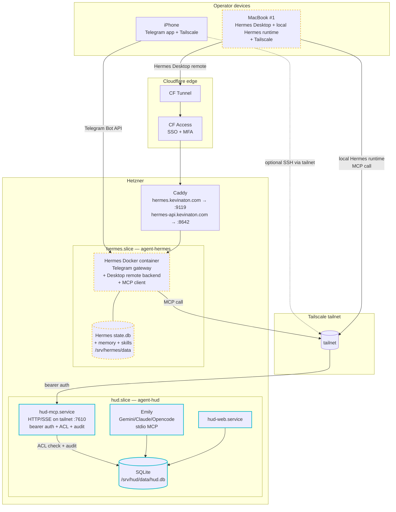

# Hermes Distributed Tenant + HUD MCP Bridge

## Context

HUD's agent layer today is single-platform: Emily (a persona) runs inside `agent-hud` on Hetzner and reaches the cashflow lib via stdio MCP per-session (`26060701`). That works for one CLI on one box.

The operator now wants to add **Hermes Agent** (Nous Research, `hermes-agent.nousresearch.com`) as a **second, independent agent platform** with these properties:

- Hermes is third-party code (Python 3.11 + Node 22 + Playwright + Chromium). It is **not** an HUD persona; it is a foreign system.
- The operator interacts with Hermes from multiple devices: MacBook (Hermes Desktop, native), iPhone (Telegram gateway). Future MacBook #2 deferred.
- Hermes must be able to **act on HUD data** — add cashflow transactions ("grocery 400" from Telegram or Desktop) — but should not be allowed to wipe or restructure HUD state.
- Hermes has its own DB, sessions, memory, and skills. Those are private to Hermes; nothing crosses into HUD's data plane except live MCP calls.
- Emily stays the frontfacing HUD persona; Hermes is positioned as a peer ("neighborhood of Emily, but they are friends" — operator's framing).

This blueprint defines: (1) the trust boundary between HUD and Hermes, (2) the `mcp-hud` daemon promotion that makes multi-client MCP possible, (3) the per-device Hermes topology, (4) the network primitive (Tailscale) that connects MacBook Hermes to Hetzner MCP, (5) the ACL + audit conventions that keep blast radius bounded.

This is a **net-new tenant** on the multi-tenant server (`26060503`), peer to `hud` and `portfolio`. It is **not** a refactor of `26060701` — Emily is unchanged. The only HUD-side change is `mcp-hud` gaining a daemon mode.

## Strategic Objective

- **3 months (MVP):** Operator types "grocery 400" in Telegram on iPhone → Hermes-on-Hetzner adds a `-$400` row to HUD cashflow, with `audit_log.actor=platform:hermes-gateway`. Operator types the same in Hermes Desktop on MacBook #1 → row appears with `actor=platform:hermes-macbook-a`. Both flows use the same MCP call; identities are distinguishable in audit.
- **12 months:** MacBook #2 is added by appending one row to the ACL and joining the tailnet — no architectural change. Hermes' tool surface on HUD has expanded carefully (vault read, calendar read) but destructive operations remain Emily-only. A 60-day usage signal has either triggered Honcho adoption or confirmed local-only memory is sufficient.
- **24 months:** Any future foreign agent platform (a research agent, a coding agent, a procurement agent) reaches HUD via the same `mcp-hud` daemon, same ACL pattern, same audit prefix (`platform:<name>`). The boundary scales without redesign.

## Current State

### Verified this session
- `mcp-hud` per `26060701` §2 is **per-session stdio**, spawned by Gemini/Claude/Opencode. It cannot be called by a non-local process or by a process in a different network namespace (Docker container, remote host).
- `26060701` §2 explicitly flags daemon-mode-over-socket as deferred work, with trigger conditions. **This blueprint triggers that work** — adding Hermes is the third caller that justifies it, after Emily-on-Gemini and Emily-on-Claude.
- `26060503` provisions the tenant pattern: `/srv/<tenant>/` + dedicated unix user + slice + AppArmor. Currently `hud` and `portfolio` slices exist. Hermes will be the third.
- Hermes Agent ships an official Docker image `nousresearch/hermes-agent:latest` (Debian 13.4 base). All state in one mounted dir at `/opt/data`. Two service ports: `8642` (OpenAI-compatible gateway API, bearer-auth) and `9119` (web dashboard with three auth modes: Nous OAuth, self-hosted OIDC, basic auth).
- Hermes is an **MCP client** (`mcp_tool.py` in the upstream repo). Its MCP server config supports **two transports only**: stdio (`command:` + `args:`) and HTTP/SSE (`url:`). **No unix-socket transport.** Bridging via a stdio→socket subprocess is possible but adds a moving part.
- Hermes Desktop is native macOS / Windows / Linux (Electron). **No iOS app**; iPhone access is Telegram (or other messaging gateways Hermes ships).
- Hermes' state DB (`state.db`, SQLite + FTS5) is **not** safe to share over a network filesystem. Per-device sessions accepted as the model.

### Not yet existing
- `mcp-hud` daemon mode (long-running service listening on a network endpoint).
- Network identity / ACL for non-`agent-hud` MCP callers.
- `audit_log.actor` prefix `platform:<name>` (the enum in `26060701` §3 covers `user`, `agent:<persona>/<cli>`, `system` — does **not** cover foreign platforms).
- `/srv/hermes/` tenant slot, `agent-hermes` unix user, `hermes.slice`.
- Tailscale on Hetzner or on any operator device.
- Per-device API tokens for the MCP daemon.

### Constraints
- Operator handles macOS-side isolation of Hermes themselves (running under dedicated mac user, TCC permissions). Out of scope here.
- MVP includes **one MacBook + iPhone + server-side Hermes-as-Telegram-gateway**. MacBook #2 deferred; architecture must support adding it as a config change.
- Hermes' write surface on HUD at MVP is **add + read only**. No edit, no delete, no createCategory. (Operator initially requested edit/delete; pushback accepted — see Decision D1.)
- No shared memory backend at MVP (Honcho/Mem0 deferred — see Decision D2).
- No skills sync at MVP (deferred per operator).

## Proposed Approach

### 1. Trust boundary — Hermes is *outside* HUD's plane

This is the single most important framing in the blueprint. Restate plainly:

```
HUD trust boundary
══════════════════════════════════════════════════
  agent-hud (UID 2011)  →  /srv/hud/*
    ├── Web app (hud-web.service)
    ├── Emily (Gemini/Claude/Opencode, persona loaded)
    └── mcp-hud daemon  ◄── new in this blueprint
══════════════════════════════════════════════════
                          │
                          │ network call across boundary
                          │ (Tailscale-only, bearer-auth, ACL'd)
                          │
══════════════════════════════════════════════════
  agent-hermes (UID 2012) → /srv/hermes/*   (server side)
  hermes user on MacBook  → ~/.hermes/*     (device side)
══════════════════════════════════════════════════
```

**Implications:**

- Hermes is treated like a hostile-by-default caller. Its MCP requests carry a token; the daemon authenticates and authorizes per request. There is no implicit trust just because Hermes runs on the same box.
- Emily is *inside* the boundary — she runs as `agent-hud`, calls the same lib via stdio MCP, has full tool access. Hermes is *outside* — she runs as `agent-hermes` (or as a tailnet peer), calls the daemon, has a restricted tool set.
- This means `audit_log.actor` has three semantic tiers, not two:
  - `user` — Kevin typed it in a browser.
  - `agent:<persona>/<cli>` — an HUD persona used a tool (Emily today, future Ops agent).
  - `platform:<name>` — a foreign platform called the MCP daemon (Hermes today, future others).

### 2. mcp-hud daemonization

The deferred work from `26060701` §2 is now load-bearing. Specification:

- **Service:** `hud-mcp.service` (systemd unit, User=`agent-hud`, in `hud.slice`).
- **Transport:** HTTP/SSE on `127.0.0.1:7610` **and** on the tailnet interface (e.g. `100.x.y.z:7610`). Not on the public interface. Caddy does **not** front this — it is private-network-only.
- **Why HTTP/SSE, not unix socket:** Hermes' MCP client supports only stdio and HTTP/SSE. Unix socket would require an in-container `socat` bridge per Hermes install. HTTP/SSE is the one transport that works natively for both server-side Hermes (Docker) and MacBook Hermes (across tailnet), with no bridges.
- **Tailnet listener via `tailscale serve`:** rather than binding to a tailnet IP directly (which can shift on node rejoin), the daemon binds to `127.0.0.1:7610` and `tailscale serve --bg https / http://127.0.0.1:7610` exposes it on the tailnet with Tailscale-managed TLS. This is the boring, supported path.
- **Authentication:** bearer token in `Authorization: Bearer <token>` header. Token is opaque, ≥ 32 bytes random, generated at provisioning, stored in `/srv/hud/secrets/mcp-tokens.yaml` (mode 600, owner `agent-hud`).
- **Authorization (ACL):** per-token identity mapping + per-identity tool allowlist (see §5).
- **Lifecycle:** systemd `Restart=on-failure`, `RestartSec=5s`, `StartLimitBurst=10`. Survives Hermes restarts and individual MCP errors.
- **Concurrency:** Node MCP server, single process, SQLite WAL handles concurrent writes from web + MCP. Per `26060701`, `busy_timeout=5000ms` set everywhere.
- **Emily impact:** **none at first**. Emily's existing per-session stdio MCP keeps working (the daemon and the stdio mode are not mutually exclusive — they're the same code, different invocation). Migration of Emily to the daemon is a separate, optional follow-up (see Phase B5).

### 3. Tenant layout — `/srv/hermes/`

Following `26060503` recipe:

```
/srv/hermes/                       owner: agent-hermes:agent-hermes, mode 0750
├── data/                          mode 0700 — bind-mounted into Docker as /opt/data
│   ├── .env                       mode 0600 — Hermes API keys, MCP bearer token
│   ├── auth.json                  mode 0600 — Hermes dashboard auth state
│   ├── config.yaml                mode 0640 — model wiring, MCP server config
│   ├── state.db                   SQLite + FTS5 (Hermes sessions)
│   ├── memories/                  Hermes memory store (local at MVP)
│   ├── skills/                    Hermes skill markdown files
│   └── work/                      working dir for tool outputs
├── docker/
│   └── docker-compose.yml
└── logs/                          journald + Docker logs (rotated)
```

**Unix user:** `agent-hermes`, UID 2012, primary group `agent-hermes`, supplementary group `hud-mcp-clients` (a new group whose only purpose is "may receive an MCP bearer token" — not currently used for filesystem perms, but reserved for future MCP-over-unix-socket if we ever switch).

**Slice:** `hermes.slice`, CPU quota 60%, MemoryMax 4G (Playwright/Chromium is hungry), TasksMax 512. Cap is intentionally higher than `26060701`'s `agents.slice` because Hermes will run a real browser; Emily does not.

**AppArmor:** profile `hermes-agent` denying reads to `/srv/hud/`, `/srv/portfolio/`, `/root/`, `/etc/sudoers*`, `/home/`. Allows reads under `/srv/hermes/` only. Phase L4 hardening per `26060503` pattern.

**Docker on the host:** **rootless Docker for `agent-hermes`** (`systemctl --user enable docker`). The Hermes container runs under `agent-hermes`'s UID namespace; container root maps to UID 2012 on the host, not real root. This is the second isolation layer (slice + container) — neither alone is sufficient for third-party code.

### 4. Hermes deployment — Docker, gateway-only role at MVP

**docker-compose.yml** (in `/srv/hermes/docker/`):

```yaml
services:
  hermes:
    image: nousresearch/hermes-agent:latest
    container_name: hermes
    restart: unless-stopped
    network_mode: bridge          # NOT host — see §6 on network isolation
    extra_hosts:
      - "hud-mcp.tailnet:host-gateway"   # see §6
    environment:
      PUID: "2012"               # = agent-hermes
      PGID: "2012"
      API_SERVER_ENABLED: "true"
      API_SERVER_HOST: "0.0.0.0"  # inside container only; host port-mapped to 127.0.0.1
      API_SERVER_KEY_FILE: "/opt/data/.env"     # Hermes reads from .env
      HERMES_DASHBOARD: "1"
    volumes:
      - /srv/hermes/data:/opt/data
    ports:
      - "127.0.0.1:8642:8642"     # gateway — only loopback; Caddy proxies
      - "127.0.0.1:9119:9119"     # dashboard — only loopback; Caddy proxies
    deploy:
      resources:
        limits:
          cpus: "2.0"
          memory: 4G
```

**Caddy adds two new sites** (per existing edge in canvas Layer 1):

- `hermes.kevinaton.com` → `127.0.0.1:9119` (dashboard). CF Access **on** (operator's existing pattern; if Hermes Desktop hits CF Access compatibility issues per the Hermes docs note, fall back to OIDC-only).
- `hermes-api.kevinaton.com` → `127.0.0.1:8642` (gateway). CF Access **off** because Hermes Desktop remote-gateway uses non-standard headers that CF Access strips. Security here = `API_SERVER_KEY` bearer auth from the client + Cloudflare WAF rate-limiting. Document this as a deviation from the default "CF Access in front of everything" pattern.

**Hermes' role at MVP:** Telegram gateway + Hermes Desktop remote backend. It runs the agent loop server-side, executes tool calls (including HUD MCP calls), exposes UI/API for clients. It is a **full Hermes install**, not a stub.

### 5. ACL + identity model

**Token store:** `/srv/hud/secrets/mcp-tokens.yaml`, mode 600, owner `agent-hud`. One token per device/identity:

```yaml
# Generated at provisioning. Tokens are opaque 32-byte random hex.
tokens:
  - identity: platform:hermes-gateway
    token_hash: "argon2id$..."        # never store plaintext
    issued: 2026-06-09
    notes: "Server-side Hermes Docker container — Telegram + Desktop backend"
  - identity: platform:hermes-macbook-a
    token_hash: "argon2id$..."
    issued: 2026-06-09
    notes: "MacBook #1 local Hermes via tailnet"
  # MacBook #2 added later by appending another entry
```

The daemon hashes incoming bearer tokens with argon2id at request time and matches against the stored hash. No plaintext token ever lives on disk on the HUD side.

**ACL** (`/srv/hud/secrets/mcp-acl.yaml`, mode 600):

```yaml
identities:
  agent:emily:                     # internal — full surface (Emily and future personas)
    allow: ["*"]

  platform:hermes-gateway:         # external — add + read only
    allow:
      - cashflow.add
      - cashflow.list
      - cashflow.summary
      - cashflow.categories
    deny:
      - cashflow.edit
      - cashflow.delete
      - cashflow.createCategory
      - "vault.*"
      - "calendar.*"

  platform:hermes-macbook-a:       # same surface as gateway
    allow:
      - cashflow.add
      - cashflow.list
      - cashflow.summary
      - cashflow.categories
    deny:
      - cashflow.edit
      - cashflow.delete
      - cashflow.createCategory
```

**Defaults:** unknown identity → deny all. Empty allow list → deny all. Deny wins over allow on conflict.

**Audit log:** every MCP call writes `audit_log.actor = <identity>` from the resolved token. The `agent:<persona>/<cli>` format from `26060701` and the new `platform:<name>` format from this blueprint coexist. CHECK constraint per `26060701` A0 is prefix-based and already permits both.

### 6. Network topology — Tailscale

**Tailnet members at MVP:**
- Hetzner (1 node, runs HUD + `mcp-hud` daemon + Hermes container).
- MacBook #1 (operator's daily driver — local Hermes Desktop).
- iPhone (Tailscale iOS app; not strictly required for Telegram-only access but harmless and useful for SSH/etc.).

**Within the tailnet:**

- `mcp-hud` daemon listens on Hetzner's tailnet IP via `tailscale serve` (TLS terminated by Tailscale). URL is something like `https://hud.your-tailnet.ts.net:7610`.
- MacBook Hermes config (`~/.hermes/config.yaml`) MCP server entry:
  ```yaml
  mcp_servers:
    hud:
      url: "https://hud.your-tailnet.ts.net:7610"
      headers:
        Authorization: "Bearer ${HUD_MCP_TOKEN}"   # token from ~/.hermes/.env
  ```
- Server-side Hermes Docker container's MCP config: same URL (resolves over the same tailnet from inside the container as long as Tailscale runs on the host and the container is `network_mode: bridge` + `extra_hosts`). **Confirm during implementation** that the container can hit the host's tailnet IP — if not, switch to `network_mode: host` for the Hermes container (acceptable trade — Hermes inside Docker is already isolated by user namespace + AppArmor).

**Tailscale ACLs (Tailscale-side, separate from MCP ACL):**

```jsonc
{
  "acls": [
    {
      "action": "accept",
      "src":    ["tag:hermes-client"],
      "dst":    ["tag:hud-mcp:7610"]
    }
  ],
  "tagOwners": {
    "tag:hermes-client": ["kevin@..."],
    "tag:hud-mcp":       ["kevin@..."]
  }
}
```

Hetzner is tagged `tag:hud-mcp`. MacBook is tagged `tag:hermes-client`. Only `:7610` is reachable from `hermes-client` nodes — SSH, web UI, etc. use different rules.

### 7. Diagram



Solid teal = inside HUD trust boundary. Dashed yellow = external platforms. The MCP daemon is the only thing that talks to both.

### 8. Audit log — three-tier actor enum

Building on `26060701` §3:

| Value pattern | Tier | Meaning |
|---|---|---|
| `user` | Internal | Kevin in a browser |
| `agent:<persona>/<cli>` | Internal | HUD persona (Emily today, future Ops) via a CLI |
| `platform:<name>` | **External (new)** | Foreign platform: `platform:hermes-gateway`, `platform:hermes-macbook-a`, future `platform:<other>` |
| `system` | Internal | Migrations, seeders |

`26060701` A0's prefix CHECK constraint accommodates `platform:%` directly; no migration change needed beyond updating the constraint regex once during this blueprint's A0-equivalent task. Concretely the new check is:

```
actor = 'user'
OR actor = 'system'
OR actor LIKE 'agent:%/%'
OR actor LIKE 'platform:%'
```

### 9. Updated canvas Layer 2

The canvas Layer 2 group ("Multi-Agent Runtime") currently contains "CLI Agents — Claude/Gemini/Opencode" and "Hermes" as siblings. After this blueprint, Layer 2 splits visually into two sub-zones:

- **HUD-internal agents** (inside trust boundary): CLI agents (Emily on Gemini/Claude/Opencode), future Ops agent.
- **External platforms** (outside trust boundary, dashed border): Hermes (server-side gateway role) — and on Layer 0/devices, MacBook Hermes appears as a client connecting to Layer 1 via tailnet.

Canvas edit will be a follow-up file task; this blueprint doesn't modify the canvas inline.

## Alternatives Considered

**A. Hermes containerized on Hetzner only; no per-device installs.**
- Pro: One Hermes install. Simpler ACL (one identity). No Tailscale needed for MCP — Hermes calls MCP over loopback.
- Con: Playwright/Chromium on Hetzner eats 3–4 GB RAM. Browser runs in a headless container — no access to the operator's real logged-in browser context (cookies, MFA). Latency for local tools is RPC instead of native. The operator explicitly chose otherwise.
- **Rejected** per operator direction Q6.

**B. Hermes only on MacBook; no server install.**
- Pro: Lightest server footprint.
- Con: iPhone has no native Hermes app — Telegram gateway requires a long-running Hermes process that's never asleep, which the MacBook isn't. Forfeits iPhone access entirely.
- **Rejected.** iPhone access is a stated requirement.

**C. mcp-hud over unix socket only; Hermes uses `socat` to bridge.**
- Pro: No network surface. Kernel-level peer-credentials identity.
- Con: Hermes' MCP client doesn't support unix sockets (verified). Bridging via `socat` works for the server-side Hermes container (bind-mount the socket in) but **does not work for MacBook Hermes** — sockets don't cross machines. We'd end up with two transports anyway.
- **Rejected.** HTTP/SSE on tailnet is the one transport that works for both clients with no bridges.

**D. mcp-hud over public HTTPS (`mcp.kevinaton.com`) with bearer auth + CF Access.**
- Pro: No new network primitive. Reuses existing edge.
- Con: Public attack surface. Hermes Desktop's CF Access incompatibility forces CF Access off for the dashboard, and we'd accept the same trade-off for the MCP endpoint. Then defense reduces to a single bearer token + CF rate-limit — narrow margin. Tailscale gives WireGuard mTLS + private network + audit logging at the network layer for free.
- **Rejected.** Tailscale costs less complexity than the security-budget required to make public HTTPS MCP genuinely safe.

**E. Honcho memory backend at MVP.**
- Pro: Cross-device memory works on day one.
- Con: A new self-hosted service (Postgres-backed), new backup target, new failure mode, and the operator hasn't yet felt the pain of per-device memory. Premature.
- **Rejected at MVP.** Trigger: see Decision D2.

**F. Build our own memory backend on HUD's SQLite.**
- Pro: Reuses existing infrastructure.
- Con: Real memory backends (fact extraction, recency/relevance scoring, embedding storage) are weeks of work. Hermes won't natively consume a custom backend; we'd fork Hermes' provider interface. We'd be building Honcho-lite, worse, and operating it ourselves.
- **Rejected outright.** Not our business to build.

**G. Hermes runs with `network_mode: host` instead of bridge.**
- Pro: Simplifies tailnet reachability from inside the container.
- Con: Removes Docker's network namespace isolation. Hermes can bind any port; can reach any host service on loopback (including HUD web, Caddy admin, anything else listening on 127.0.0.1).
- **Rejected as default.** Fall back to host networking only if bridge-mode tailnet reachability proves intractable during implementation; document as debt if so.

**H. Skip Tailscale; use WireGuard directly.**
- Pro: One fewer SaaS dependency.
- Con: Manual key distribution, manual ACL config, manual NAT traversal. Tailscale wraps WireGuard with exactly the operations we don't want to build. For a one-operator system, Tailscale's free tier is the right primitive.
- **Rejected.** WireGuard remains an option if Tailscale's terms ever shift wrong; today the trade is clear.

## Security & Threat Model

### Trust boundaries (restated)

```
[operator device] ── tailscale-WG ── [tailnet] ── tailscale-WG ── [Hetzner host]
                                                                     │
                                                                     ├─ HUD trust boundary
                                                                     │    ├ agent-hud (UID 2011)
                                                                     │    └ hud-mcp.service
                                                                     │
                                                                     └─ Hermes trust boundary (FOREIGN)
                                                                          ├ agent-hermes (UID 2012)
                                                                          ├ rootless Docker
                                                                          └ Hermes container
```

**Three trust zones:** operator (devices), HUD (server-side), Hermes (server-side and device-side). The MCP daemon is the only thing that crosses from "outside HUD" to "inside HUD".

### STRIDE

- **Spoofing.**
  - Hermes-to-MCP: bearer token in `Authorization` header; tokens stored as argon2id hashes; per-identity. A leaked token grants the holder exactly that identity's ACL — no escalation.
  - Tailnet-to-MCP: Tailscale ACL restricts `tag:hermes-client` to only `:7610` on Hetzner. Compromised tailnet node still can't reach Caddy admin, SSH, or anything else.
  - **New consideration:** the Hermes container's outbound MCP requests carry the bearer token in its env. If a Hermes container compromise occurs (prompt-injected to read env), the token leaks. Mitigation: token is scoped (only `platform:hermes-gateway` ACL), short-lived (rotate every 90 days), and recoverable (revoke + reissue is a YAML edit + systemctl reload).

- **Tampering.**
  - MCP daemon write paths: SQLite WAL only. No file writes outside DB and journald.
  - ACL/token files (`/srv/hud/secrets/mcp-tokens.yaml`, `mcp-acl.yaml`): mode 600, owner `agent-hud`. AppArmor on `agent-hermes` denies reads under `/srv/hud/`.
  - Hermes container can't tamper with HUD code: it has zero filesystem access outside `/srv/hermes/data/` (its own data dir bind-mount).

- **Repudiation.**
  - Every MCP call writes `audit_log` with `actor=<identity>`, `ip_address=<source-tailnet-ip>`, `user_agent='mcp-hud/<version>'`. A `mcp_request_id` (random per request) joins the audit row to the journald log for the daemon.
  - Hermes' own session DB also records its tool calls; cross-correlation is possible (HUD audit ↔ Hermes session) by `mcp_request_id` if Hermes is configured to log it.

- **Information disclosure.**
  - **Tailnet sniffing:** ruled out — WireGuard end-to-end encryption.
  - **Token storage at rest:** argon2id hash on HUD side; plaintext in `~/.hermes/.env` mode 600 on Hermes side. Plaintext is required because Hermes presents the token live to HUD; can't avoid it.
  - **Hermes outbound to Nous / model APIs:** all of Hermes' prompts, tool calls, and tool responses egress to whichever LLM provider is configured (OpenRouter/Anthropic/etc.) and to Nous Portal for telemetry/OAuth. **This means HUD transaction data Hermes fetches (via `cashflow.list`) leaves the box.** Documented as accepted; the operator owns this trade by choice of using a hosted LLM. Mitigation option (deferred): route Hermes through a local LLM (e.g. Ollama) — eliminates egress but worse output quality.
  - **Cross-device disclosure:** MacBook #1's Hermes cannot read MacBook #2's Hermes data — they have independent installs and the tailnet ACL has no peer-to-peer path enabled by default.

- **Denial of service.**
  - Hermes container resource cap: 4 GB RAM, 2 CPU. Even runaway Playwright instances bounded.
  - MCP daemon: Node single-process. Rate-limit at the daemon (Phase B3 — token-bucket per identity, e.g. 60 writes/minute, 600 reads/minute). Prevents a prompt-injected Hermes from flooding HUD writes.
  - SQLite WAL handles concurrent writers; no contention storms under realistic load.

- **Elevation of privilege.**
  - `agent-hermes` has **no sudo entries**. Hermes container is rootless. Inside the container, even root maps to UID 2012 outside.
  - MCP ACL is the authoritative privilege gate at the application layer: even a fully prompt-injected Hermes cannot call `cashflow.delete` because the daemon denies it before the lib is invoked.

### Prompt injection blast radius (the headline risk for this design)

**Where the injection can come from:**
1. A Hermes-scraped webpage (Hermes' browser tool follows a hostile site).
2. A Telegram message from a non-allowlisted sender (Hermes' gateway should ignore these — verify in implementation).
3. A document the operator pastes into Hermes that itself contains injection content.

**What a fully prompt-injected Hermes can do:**
- Call any tool in its MCP allowlist with attacker-chosen arguments: **`cashflow.add` with arbitrary item/amount, `cashflow.list` (read all data).** `delete`, `edit`, `createCategory` are denied at the daemon — verified per ACL.
- Use Hermes' other tools (its own filesystem inside the container, its own browser, web search, etc.).
- Exfiltrate via Hermes' egress (LLM API, web fetch).

**Controls:**
- ACL deny-by-default at the daemon — the most important control. `delete`/`edit` are out of reach by design at MVP.
- Audit log captures every call with identity + arguments → forensic recoverability.
- Rate limiting (Phase B3) caps damage volume.
- Hermes itself has a confirm-before-act discipline in many tool flows (per upstream docs); reinforce in `/srv/hermes/data/skills/hud-cashflow-policy.md`: "before any cashflow.add, restate to the operator: item, amount, category. Proceed only after confirmation." This is the Hermes-side companion to Emily's hard rules.

**Residual risk accepted:** a prompt-injected Hermes can add bogus cashflow rows (single transactions only, capped by rate limit, fully audited). The forensic + rollback path is: identify rows by `actor=platform:hermes-*` in the audit log; soft-delete via Emily (`cashflow.delete`); document in the postmortem. Cost of a successful attack is bounded and recoverable.

### Controls mapped to threats

| Threat | Control | Layer |
|---|---|---|
| Hermes-to-HUD identity spoof | Bearer token + argon2id hash + per-identity ACL | App |
| Tailnet node compromise spreads to MCP | Tailscale ACL restricts dst to `:7610` only | Network |
| Token leak via Hermes container compromise | Scoped ACL (add+read only); 90-day rotation; instant revoke | App + ops |
| MCP write flood from prompt-injected Hermes | Daemon rate limit per identity (Phase B3) | App |
| Hermes container escapes to host | Rootless Docker + AppArmor + slice quotas | Container + host |
| Public exposure of MCP daemon | Daemon does **not** listen on Caddy or public iface | Network |
| Audit gap on foreign-platform calls | `platform:<name>` actor + `mcp_request_id` per call | App |
| Cross-device data disclosure between MacBook Hermes installs | Independent installs + no tailnet peer-to-peer ACL | Network + design |
| Hermes egress of HUD data to LLM provider | Documented accepted risk; optional local-LLM mitigation | Policy |

### Residual risk

- **LLM provider compromise.** Hermes' prompts + tool I/O leave the box to whichever model provider is configured. If that provider is breached, HUD transaction content is part of the loss. Mitigation: provider choice + key rotation + (long-term) local model option.
- **Tailscale account compromise.** A stolen Tailscale credential lets an attacker add a node to the tailnet. Mitigation: Tailscale SSO with MFA; reauth interval ≤ 90 days; alerts on new device joins.
- **Operator device compromise (MacBook).** A compromised MacBook owns the Hermes token, the Tailscale identity, and direct MCP write access (add/list/summary). Mitigation: MacBook OS hygiene is the operator's responsibility per Q2; the MCP ACL bounds damage to add+read.

## Risks & Mitigations

| Risk | Detection | Response |
|---|---|---|
| `tailscale serve` config drifts (e.g. after host reboot) and MCP becomes unreachable | Hermes session shows "MCP tool unavailable" errors; Uptime Kuma probe against tailnet IP | Restart `tailscaled`; verify `tailscale serve status`; alert if down > 5 min |
| Bearer token leaked from a MacBook (lost device, etc.) | Operator observation; new tailnet device alerts | Revoke entry in `mcp-tokens.yaml`; `systemctl reload hud-mcp.service`; reissue new token |
| Hermes container OOM-kills due to Playwright spike | journald `oom-killer`; container restart loop | Raise MemoryMax to 6G; profile the workload; consider per-tool memory caps |
| ACL drift (operator manually edits but misses an identity) | New identity hits "deny default" — Hermes reports tool unavailable | YAML schema validation in deploy script; CI lint on `mcp-acl.yaml` |
| Hermes Desktop CF Access compatibility breaks | Operator reports auth loop | Move dashboard auth fully to OIDC (per Hermes docs option 2); disable CF Access on `hermes.kevinaton.com` only |
| Daemon mode introduces a regression Emily depends on | Emily session fails on tool call | Emily stays on per-session stdio MCP at A1; daemon migration deferred to B5 with rollback plan |
| Operator forgets which device added a weird transaction | `audit_log` query by date + actor | `select actor, item, amount_minor, occurred_at from transactions join audit_log ...` — actors are distinct by design |
| MacBook offline, Telegram still works → state diverges? | N/A — both paths write to the same HUD DB; nothing diverges | Acceptable; same DB, atomic writes |
| Per-device Hermes memory means MacBook doesn't remember Telegram conversations | Operator friction observation over 60 days | If real, trigger Honcho adoption (Decision D2) |

## Phased Implementation

| Phase | Outcome | Depends on | Effort | Exit criteria |
|---|---|---|---|---|
| **B0 — Audit enum extension** | `audit_log.actor` CHECK constraint updated to allow `platform:%`; existing rows unaffected | `26060701` A0 | S (1h) | Migration applies; `INSERT actor='platform:hermes-test'` succeeds; invalid actor still rejected |
| **B1 — `mcp-hud` daemon mode** | `hud-mcp.service` systemd unit, listens on `127.0.0.1:7610` with HTTP/SSE; bearer auth middleware; ACL loader; per-call audit row including `mcp_request_id`. Emily's stdio MCP unchanged — daemon runs in parallel | `26060701` A1b–A2 (mcp-hud package exists) | M (2d) | `curl -H 'Authorization: Bearer <token>' http://127.0.0.1:7610/mcp` responds with MCP handshake; ACL denies bad-token call with 401; ACL denies disallowed-tool call with 403; audit row exists for every call |
| **B2 — Tailscale on Hetzner + `tailscale serve`** | Tailscale installed on Hetzner, MagicDNS on, MCP exposed at tailnet URL with Tailscale-managed TLS; Tailscale ACL restricts dst to `:7610` for `tag:hermes-client` | B1 | S (3h) | `https://hud.<tailnet>.ts.net:7610` reachable from another tailnet device with the bearer token; non-bearer fails; non-tailnet (public IP) fails to reach |
| **B3 — Rate limiting + observability** | Token-bucket per identity in `hud-mcp.service` (default 60 writes/min, 600 reads/min); Sentry breadcrumbs on all 4xx/5xx; per-identity metrics in Uptime Kuma or simple Prometheus exporter | B2 | S (4h) | Synthetic flood test: 100 rapid `cashflow.add` calls get 429 after limit; metric visible per identity |
| **B4 — Hermes tenant provisioning** | `/srv/hermes/` created with full layout; `agent-hermes` UID 2012; `hermes.slice` (4G/2cpu); rootless Docker for `agent-hermes`; AppArmor profile deployed; Caddy adds `hermes.kevinaton.com` + `hermes-api.kevinaton.com` with the auth deviation documented | `26060503` L0–L2, B3 | M (1d) | `systemctl --user --machine=agent-hermes@.host status` shows rootless Docker daemon up; `agent-hermes` cannot read `/srv/hud/` (AppArmor verified); both subdomains resolve and 200 from `curl` |
| **B5 — Hermes Docker compose up; Telegram gateway live** | `docker-compose.yml` deployed; Hermes container running; Telegram bot configured with allowlisted `telegram_user_id`; Hermes' `config.yaml` has the HUD MCP server entry with the gateway token | B4 | M (1d) | Operator sends "ping" to Hermes via Telegram → reply received; Hermes Desktop on MacBook connects to `hermes-api.kevinaton.com` and sees the same agent |
| **B6 — End-to-end cashflow.add via Hermes** | From Telegram and from Hermes Desktop, operator says "grocery 400"; Hermes calls `cashflow.add`; row appears in HUD web UI; `audit_log` shows the correct `platform:hermes-*` identity; rate limit and ACL tested live | B5 | S (4h) | Both paths produce rows with distinct actor identities; `cashflow.delete` attempted via Hermes returns ACL denial; web UI delta matches |
| **B7 — MacBook Hermes install + tailnet client** | MacBook joins tailnet (`tag:hermes-client`); local Hermes installed; `~/.hermes/.env` carries `platform:hermes-macbook-a` token; MCP config points at tailnet URL | B2, B5 | S (3h) | From MacBook Hermes Desktop *in local mode* (not remote-backend mode), `cashflow.add` works; audit shows `platform:hermes-macbook-a` |
| **B8 — Hardening + docs** | Token rotation runbook in `plan/reference/`; canvas Layer 2 updated; Hermes-side skill `hud-cashflow-policy.md` baked into `/srv/hermes/data/skills/`; Uptime Kuma monitor for both Hermes ports + MCP daemon | B6, B7 | S (4h) | Runbook executable in dry-run; canvas updated; skill loaded by Hermes (verified via session test); monitors green |

**Deferred (post-MVP) — explicit triggers:**

- **Emily migration to daemon mode** (B5-equivalent in `26060701`). Trigger: operator wants Emily's audit to include `mcp_request_id` for cross-correlation, OR Emily session warm-up time becomes a friction point.
- **Honcho / shared memory.** Trigger per Decision D2.
- **MacBook #2 onboarding.** Trigger: operator's decision.
- **Hermes write surface expansion (edit, delete, vault.*, etc.).** Trigger: 60 days of clean operation with no prompt-injection incidents AND operator-stated need.
- **Local-LLM option to remove egress.** Trigger: privacy concern about model-provider egress materializes (regulatory, breach, policy change).

## Success Criteria

- Operator sends "grocery 400" via Telegram (iPhone) → row appears in HUD with `audit_log.actor='platform:hermes-gateway'`; same input via Hermes Desktop on MacBook → row with `actor='platform:hermes-macbook-a'`. Both visible in HUD web UI.
- Operator attempts to call `cashflow.delete` via Hermes → daemon returns 403 with reason `tool_not_allowed_for_identity`; Hermes surfaces this to the operator without retry.
- `mcp-hud` daemon is not reachable from the public internet — verified by `curl https://<hetzner-public-ip>:7610` failing, and by Cloudflare not routing to it.
- Hermes container can read `/srv/hermes/data/` only — verified by attempted `cat /srv/hud/data/hud.db` from inside the container returning permission denied (AppArmor).
- A leaked Hermes bearer token can be revoked in under 5 minutes: edit `mcp-tokens.yaml`, `systemctl reload hud-mcp.service`, leaked-token requests now 401.
- `select actor, count(*) from audit_log group by actor;` shows distinct rows for at minimum `user`, `agent:emily/<cli>`, `platform:hermes-gateway`, `platform:hermes-macbook-a`.
- Rate limit verified: a synthetic flood (100 `cashflow.add` in 10s) returns 429 after the configured burst.
- Adding MacBook #2 in the future is **a YAML edit + a token + a Tailscale join** — verified by dry-run of the runbook (no code changes required).

## Open Questions

- **OQ-1. Tailscale Funnel for the dashboard?** Hermes Desktop's CF Access incompatibility is documented. An alternative is to skip Caddy + CF Access for `hermes.kevinaton.com` and instead expose the dashboard via **Tailscale Funnel** (which gives a public HTTPS URL but routes through the tailnet). Lets us keep CF Access usable for everything else. Trade-off: another Tailscale feature to learn. Recommendation: try Caddy + OIDC first; fall back to Funnel if CF Access trips Hermes.
- **OQ-2. `network_mode: bridge` vs `host` for Hermes container.** Bridge is the safer default but tailnet reachability from inside a bridge-networked container needs verification (Tailscale on the host should make the host's tailnet IP reachable via `host-gateway`, but Docker bridge sometimes interposes). Decide during B5 implementation; document choice.
- **OQ-3. Telegram allowlist scope.** Hermes' Telegram gateway supports a sender allowlist. Confirm: only operator's `telegram_user_id`. No groups, no chats. Single-operator system.
- **OQ-4. Token rotation cadence.** Recommendation: 90 days. Operator may want shorter for paranoia, longer for convenience. Set, document, automate via a calendared reminder (no built-in scheduler at MVP).
- **OQ-5. Should `cashflow.list` and `cashflow.summary` redact `notes` field for `platform:*` identities?** Notes can contain free-text the operator wrote privately. Hermes calling `list` then echoing notes back to a Telegram message disclosed to a (legitimate) sender or to its LLM provider is mostly a self-disclosure but worth deciding. Recommendation: at MVP, no redaction (operator owns it). Revisit if Hermes ever has a non-operator user.
- **OQ-6. Container image pinning.** `nousresearch/hermes-agent:latest` floats. Pin to a digest (`sha256:...`) and update deliberately. Adds an ops step but eliminates a supply-chain auto-upgrade surprise. Recommendation: pin to digest from the start.

- **OQ-7. Persona name on the Hermes platform — Resolved 2026-06-10.**
  - **Decision:** **Andrea** is the operator-facing persona name for Hermes (counterpart to Emily on HUD). She is the voice on Telegram (iPhone) and on Hermes Desktop (MacBook). The persona is configured at the Hermes-skills layer (`/srv/hermes/data/skills/andrea/`) — Hermes is the runtime, Andrea is the character. Same separation pattern as Emily/Gemini in `26060701` §8.
  - **Audit log impact:** `audit_log.actor` continues to use the platform-level identity (`platform:hermes-gateway`, `platform:hermes-macbook-a`) — Andrea is UX-layer naming, not an audit identity. If Hermes ever runs a *second* persona, we'll extend to `platform:hermes-gateway/andrea` mirroring `agent:emily/<cli>` — additive, no migration needed (the prefix-based CHECK constraint allows it).
  - **Implementing tickets affected:** the "Hermes-side skill" ticket in Phase B5 should write `/srv/hermes/data/skills/andrea/persona.md` (Andrea identity, voice, hard rules) plus `/srv/hermes/data/skills/andrea/hud-cashflow-policy.md` (the operational policy already specified). Naming convention parallels Emily.
  - **Out of scope for this blueprint:** the substantive Andrea persona content (voice, rules, examples) is a separate, smaller artifact — author it during B5 task execution, not here. This OQ only locks the *name* and the *naming convention*.

## Debt Incurred

- **CF Access bypassed for `hermes-api.kevinaton.com`.** Bearer auth + CF WAF only on the gateway endpoint, because Hermes Desktop remote-backend mode mangles non-standard headers through CF Access. Trigger to revisit: Hermes upstream fixes the header-passthrough issue, OR we accept a CF Access Workers-based custom auth shim.
- **Per-session stdio MCP for Emily retained.** Emily's existing path is left untouched in this blueprint to avoid scope creep. Daemon-mode migration of Emily becomes its own follow-up. Trigger: operator wants `mcp_request_id` on Emily's audit rows, or Emily session warm-up becomes friction.
- **Idempotency keys not implemented at MVP.** Two Hermes instances (or operator double-tapping a message) can both call `cashflow.add` with identical args and create duplicate rows. Acceptable at MVP scale (operator can spot + delete duplicates via Emily). Trigger: any observed duplicate, or operational pattern of multi-device dictation.
- **No shared memory at MVP.** Per-device Hermes memory only. Trigger: 60 days of usage AND operator-observed friction from re-stating preferences AND willingness to operate Honcho.
- **No skills sync at MVP.** Each Hermes install has its own skills. Trigger: operator-observed friction, OR a skill becomes load-bearing enough to need versioning.
- **Hermes container image floats (`:latest`) until B8.** OQ-6 resolution should pin to a digest before production traffic.

## Development Locus — Local vs Server

Two kinds of work, two physical loci. The orchestrator must tag every ticket with one of `locus: local`, `locus: server`, or `locus: hybrid` so the engineer knows where to do the work and which test loop applies.

| Locus | Definition | Test loop |
|---|---|---|
| **local** | Pure code/config that lives in the monorepo. Authored on the laptop, tested with `pnpm test` + `pnpm typecheck`. Ships to server via `git pull` + `systemctl reload`. Never touches production state during development. | Vitest + local SQLite tmpfile. CI must pass before deploy. |
| **server** | Linux/Hetzner-specific primitives that have no faithful macOS equivalent: systemd unit installation, Tailscale node identity, rootless Docker daemon, AppArmor profiles, real tenant filesystem layout. Authored locally when possible (unit text, compose files); *executed* and *verified* only on the server. | SSH session + `journalctl -fu <unit>` + `systemctl status` + `curl` probes. |
| **hybrid** | Has both code-authoring (local) and infra-execution (server) steps. Ticket Acceptance Criteria spans both. Split into sub-tasks; both AC blocks must close before the ticket is done. | Local AC closes via Vitest; server AC closes via deploy + probe. |
| **device** | Operator's MacBook or iPhone. Tailnet join, local Hermes install, `~/.hermes/.env` setup. | Manual verification by operator; runbook-checked. |

**`HUD_MCP_MODE` safety hatch** (referenced in tickets below): the daemon must accept `HUD_MCP_MODE=dev|prod`. `dev` reads fixture ACL, accepts a hardcoded dev token, binds loopback-only, writes audit with `actor='platform:test-*'`. `prod` reads real secrets and refuses to start if files are absent or mode != 600. This makes local development safe and prod boot fail-loud.

## Tasks

Tickets to be created by the orchestrator. Locus is non-negotiable per ticket. **Sub-tasks reflect the local→server split inside hybrid tickets.** Open Questions still need operator resolution but do not block ticket creation for the marked-local tickets (they can start in parallel).

### Phase B0 — Audit enum extension

- **Ticket NN — Extend `audit_log.actor` CHECK constraint for `platform:%` prefix**
  - **Locus:** local
  - **Phase:** B0
  - **Effort:** S (1h)
  - **Sub-tasks:**
    - Add Drizzle migration that drops + re-creates the CHECK constraint with the four-arm form (`user` / `system` / `agent:%/%` / `platform:%`)
    - Add Vitest cases: `platform:hermes-gateway` accepted; `platform:` (empty suffix) rejected; existing rows still valid
    - Run migration against a copy of prod DB locally; verify no row is invalidated
  - **AC:**
    - [ ] Migration file in `apps/web/drizzle/migrations/`
    - [ ] Vitest passes locally
    - [ ] Dry-run against prod DB copy produces zero invalid rows
  - **Deploy step (separate, manual):** server-side `pnpm db:migrate` — not a sub-task, gated by ticket review.

### Phase B1 — mcp-hud daemon mode

- **Ticket NN — `hud-mcp.service` daemon: HTTP/SSE transport + bearer auth + ACL loader**
  - **Locus:** local (code) + server (install)
  - **Phase:** B1
  - **Effort:** M (2d)
  - **Sub-tasks (local):**
    - Add HTTP/SSE server mode to `packages/mcp-hud` alongside existing stdio mode (flag: `MCP_TRANSPORT=stdio|http`)
    - Implement bearer auth middleware: extract `Authorization: Bearer <token>`, verify against argon2id hash in `mcp-tokens.yaml`
    - Implement ACL loader: read `mcp-acl.yaml`, resolve identity → allowed-tools set, deny-by-default
    - Per-call audit: write `audit_log` with `actor=<identity>`, `mcp_request_id=<uuidv7>`, `ip_address=<remote-addr>`, `user_agent='mcp-hud/<ver>'`
    - Implement `HUD_MCP_MODE=dev|prod` safety hatch (see Development Locus section)
    - Vitest: auth pass/fail, ACL allow/deny per tool, audit row shape, dev-mode token, prod-mode missing-file boot failure
  - **Sub-tasks (server, deferred to Ticket NN B1-deploy below):** systemd unit install. *Authored* in `ops/systemd/hud-mcp.service` locally; installed via separate ticket so this one stays purely code-and-test.
  - **AC (local):**
    - [ ] All Vitest cases green; `pnpm test --filter mcp-hud` passes
    - [ ] Manual local run: `HUD_MCP_MODE=dev node packages/mcp-hud/dist/index.js --transport http --port 7610` + `curl -H 'Authorization: Bearer devtoken' http://127.0.0.1:7610/mcp/...` returns 200; bad token returns 401; disallowed tool returns 403
    - [ ] Emily's existing stdio path still works (`MCP_TRANSPORT=stdio`) — regression check

- **Ticket NN — Author `hud-mcp.service` systemd unit + ACL/tokens YAML schemas**
  - **Locus:** local (author) → server (install in B1-deploy ticket)
  - **Phase:** B1
  - **Effort:** S (3h)
  - **Sub-tasks:**
    - Write `ops/systemd/hud-mcp.service`: `User=agent-hud`, `Slice=hud.slice`, `Restart=on-failure`, `RestartSec=5s`, `StartLimitBurst=10`, env from `/srv/hud/secrets/mcp.env`, `NoNewPrivileges=true`, `ProtectSystem=strict`, `ProtectHome=true`, `ReadWritePaths=/srv/hud/data`
    - Write `ops/schemas/mcp-tokens.schema.yaml` and `ops/schemas/mcp-acl.schema.yaml` (JSON Schema in YAML form) for validation
    - Write `ops/secrets/mcp-tokens.example.yaml` and `ops/secrets/mcp-acl.example.yaml` (no real tokens) committed; real files only on server, never in git
    - Add `scripts/validate-mcp-config.ts` that lints both YAML files against the schemas — runs in CI
  - **AC:**
    - [ ] Unit file lints (`systemd-analyze verify ops/systemd/hud-mcp.service` — note: requires a Linux runner; do on server or in CI Linux container)
    - [ ] Schema validator catches a known-bad fixture
    - [ ] CI runs the validator on every PR

- **Ticket NN — Deploy hud-mcp daemon to Hetzner (B1-deploy)**
  - **Locus:** server
  - **Phase:** B1
  - **Effort:** S (2h)
  - **Sub-tasks:**
    - Create `/srv/hud/secrets/mcp-tokens.yaml` and `mcp-acl.yaml` (mode 600, owner `agent-hud`) with real argon2id hashes
    - Generate first three tokens (`hermes-gateway`, `hermes-macbook-a`, plus one rotation spare); store plaintext only in operator's password manager
    - Install `hud-mcp.service`, `daemon-reload`, `enable --now`
    - Verify `journalctl -u hud-mcp -n 50` clean; `curl -H 'Authorization: Bearer <real-token>' http://127.0.0.1:7610/mcp/...` returns 200 from the host
  - **AC:**
    - [ ] `systemctl status hud-mcp.service` shows active (running)
    - [ ] Bad token → 401; good token → 200
    - [ ] `audit_log` shows a row with `actor='platform:hermes-gateway'` and `mcp_request_id` populated after the probe
    - [ ] Emily's stdio MCP still works (regression check: `emily` from operator session, simple `cashflow.list` call)

### Phase B2 — Tailscale + tailnet exposure

- **Ticket NN — Install Tailscale on Hetzner + configure `tailscale serve`**
  - **Locus:** server
  - **Phase:** B2
  - **Effort:** S (3h)
  - **Sub-tasks:**
    - Install `tailscale` via official Debian repo; `tailscale up --ssh=false --hostname=hud`
    - Tag the node `tag:hud-mcp` in the Tailscale admin console
    - Verify MagicDNS resolves the node
    - **First, validate the tailnet path independent of the daemon:** `nc -l 127.0.0.1 7610` + `tailscale serve --bg https / http://127.0.0.1:7610` + `curl` from another tailnet device — confirms reachability before any daemon traffic
    - Then point `tailscale serve` at the real daemon
    - Write Tailscale ACL JSON (in repo: `ops/tailscale/acl.json`) that restricts `tag:hermes-client` → `tag:hud-mcp:7610` only
    - Document the node name, tags, and ACL approach in `plan/reference/tailscale.md`
  - **AC:**
    - [ ] `https://hud.<tailnet>.ts.net:7610` reachable from operator's MacBook with bearer token; returns 200
    - [ ] Same URL unreachable from a non-tailnet device (use phone on cellular)
    - [ ] Tailscale ACL rejects an attempt from `tag:hermes-client` to SSH or any other port
    - [ ] `plan/reference/tailscale.md` exists and documents node identity + ACL philosophy

### Phase B3 — Rate limiting + observability

- **Ticket NN — Per-identity token-bucket rate limiter + Sentry/Uptime Kuma wiring**
  - **Locus:** hybrid (code local; deploy server)
  - **Phase:** B3
  - **Effort:** S (4h)
  - **Sub-tasks (local):**
    - Add per-identity token-bucket to `packages/mcp-hud`: defaults 60 writes/min, 600 reads/min, burst 10; override via ACL YAML per-identity
    - On limit breach: return 429 with `Retry-After` header; emit Sentry breadcrumb
    - Emit `mcp.request.count{identity, tool, status}` counter (plain log line; scrape-friendly)
    - Vitest: bucket math, 429 response shape, per-identity isolation (one identity hitting limit doesn't affect another)
  - **Sub-tasks (server):**
    - Deploy new daemon version; verify counters in journald
    - Add Uptime Kuma monitor for the tailnet daemon URL (TCP probe to `:7610`); 5-minute interval
    - Synthetic flood test from operator's MacBook: 100 rapid `cashflow.list` calls within 10s; observe 429 after limit
  - **AC (local):**
    - [ ] Vitest green
    - [ ] Local manual test with `wrk` or similar: bucket reset behaves correctly
  - **AC (server):**
    - [ ] Synthetic flood produces 429 with correct `Retry-After`
    - [ ] Uptime Kuma monitor green and alerting configured
    - [ ] No false-positive 429 against normal Emily traffic (regression)

### Phase B4 — Hermes tenant provisioning

- **Ticket NN — Provision `/srv/hermes/` tenant: user, slice, AppArmor, rootless Docker**
  - **Locus:** server
  - **Phase:** B4
  - **Effort:** M (1d)
  - **Sub-tasks:**
    - Create `agent-hermes` user (UID 2012, primary group `agent-hermes`, supplementary `hud-mcp-clients`)
    - Create `/srv/hermes/` layout per blueprint §3; set ownership and modes
    - Define `hermes.slice` (CPU 60%, Mem 4G, Tasks 512) in `/etc/systemd/system/hermes.slice`
    - Enable rootless Docker for `agent-hermes`: `loginctl enable-linger agent-hermes`, `systemctl --user --machine=agent-hermes@.host enable docker`
    - Write + load AppArmor profile `hermes-agent` (denies `/srv/hud/`, `/srv/portfolio/`, `/root/`, `/etc/sudoers*`, `/home/`)
    - Verify isolation: from a shell as `agent-hermes`, `cat /srv/hud/data/hud.db` must fail
  - **AC:**
    - [ ] `id agent-hermes` returns UID 2012 with correct groups
    - [ ] `systemctl status hermes.slice` shows active
    - [ ] `systemctl --user --machine=agent-hermes@.host status docker` shows active
    - [ ] As `agent-hermes`: reading anything under `/srv/hud/` returns permission denied
    - [ ] `aa-status` lists `hermes-agent` as enforce

- **Ticket NN — Caddy entries for `hermes.kevinaton.com` and `hermes-api.kevinaton.com`**
  - **Locus:** hybrid (Caddyfile local; reload server)
  - **Phase:** B4
  - **Effort:** S (1h)
  - **Sub-tasks (local):**
    - Add two server blocks to `ops/caddy/Caddyfile`:
      - `hermes.kevinaton.com` → `127.0.0.1:9119`, with CF Access (or OIDC fallback per OQ-1)
      - `hermes-api.kevinaton.com` → `127.0.0.1:8642`, **CF Access OFF** with comment block explaining the deviation
  - **Sub-tasks (server):**
    - `git pull`, `caddy validate`, `systemctl reload caddy`
    - Verify both subdomains resolve and return Hermes' 503-not-yet-up (container not running yet at this phase)
  - **AC:**
    - [ ] `caddy validate` passes locally
    - [ ] Both subdomains return a Caddy-routed response on the server (even if Hermes is down)
    - [ ] Deviation block in Caddyfile is reviewed and committed

### Phase B5 — Hermes container + Telegram

- **Ticket NN — Author Hermes `docker-compose.yml` + provisioning script**
  - **Locus:** local (author) → server (run in B5-deploy)
  - **Phase:** B5
  - **Effort:** S (4h)
  - **Sub-tasks:**
    - Write `docker/hermes/docker-compose.yml` per blueprint §4; **pin image to a `sha256:` digest** (resolves OQ-6)
    - Document the digest pin + update procedure in `plan/reference/hermes-ops.md` (new file)
    - Write `scripts/setup-hermes.sh` that copies `docker-compose.yml` to `/srv/hermes/docker/`, validates `/srv/hermes/data/.env` exists with required keys, and prints next steps (does **not** start the container — operator does that explicitly)
    - Decide OQ-2 (`bridge` vs `host` networking) by writing a test branch in the script that probes tailnet reachability from inside a throwaway container; default to `bridge`, fall back with a clear log message
  - **AC:**
    - [ ] `docker-compose.yml` lints (`docker compose config`)
    - [ ] Setup script idempotent (running twice doesn't break state)
    - [ ] `plan/reference/hermes-ops.md` documents digest pin + update workflow

- **Ticket NN — Hermes config: HUD MCP server entry + Telegram allowlist + dashboard auth**
  - **Locus:** server (config has real tokens and chat IDs)
  - **Phase:** B5
  - **Effort:** S (3h)
  - **Sub-tasks:**
    - Author `/srv/hermes/data/config.yaml` with `mcp_servers.hud: { url: <tailnet>, headers: { Authorization: Bearer ${HUD_MCP_TOKEN} } }`
    - Populate `/srv/hermes/data/.env`: `HUD_MCP_TOKEN`, Telegram bot token, allowlisted Telegram user ID (resolves OQ-3), model API keys, dashboard auth env vars
    - Choose dashboard auth mode (resolves part of OQ-1): basic-auth + CF Access first; OIDC fallback documented
    - Mode 600 on `.env`, owner `agent-hermes`
  - **AC:**
    - [ ] `config.yaml` and `.env` exist with correct modes
    - [ ] No plaintext token visible in `ps`, `journalctl`, or `docker inspect`
    - [ ] Hermes container reads config successfully on first start (no parse errors)

- **Ticket NN — Hermes-side skill `hud-cashflow-policy.md`**
  - **Locus:** local (authored) → server (deployed to `/srv/hermes/data/skills/`)
  - **Phase:** B5
  - **Effort:** S (2h)
  - **Sub-tasks:**
    - Write `apps/hermes-policy/skills/hud-cashflow-policy.md`: hard rules (confirm before any `cashflow.add`; restate item + amount + category; never call denied tools; surface 401/403/429 honestly to the operator)
    - Add a deploy step in `scripts/setup-hermes.sh` that rsyncs the policy skill into `/srv/hermes/data/skills/`
  - **AC:**
    - [ ] Skill file exists in repo
    - [ ] Deploy step copies it on the server with correct ownership

- **Ticket NN — Start Hermes container; bring Telegram gateway live**
  - **Locus:** server
  - **Phase:** B5
  - **Effort:** S (3h)
  - **Sub-tasks:**
    - As `agent-hermes`: `docker compose up -d` from `/srv/hermes/docker/`
    - Verify container healthy: `docker compose logs hermes`, `curl 127.0.0.1:8642/health`, `curl 127.0.0.1:9119`
    - Configure Telegram bot via Hermes dashboard or CLI
    - Send "ping" from operator's Telegram → expect reply
  - **AC:**
    - [ ] Container in `Up` state
    - [ ] Both ports reachable on loopback
    - [ ] Telegram round-trip works
    - [ ] Hermes Desktop on operator's MacBook can connect to `https://hermes-api.kevinaton.com` (remote-backend mode)

### Phase B6 — End-to-end verification

- **Ticket NN — End-to-end: cashflow.add via Telegram and Hermes Desktop; ACL + rate-limit live tests**
  - **Locus:** server (real flows) + device (Telegram on iPhone, Desktop on MacBook)
  - **Phase:** B6
  - **Effort:** S (4h)
  - **Sub-tasks:**
    - Telegram → "grocery 400" → verify row in HUD web UI with `actor='platform:hermes-gateway'`
    - Hermes Desktop → same input → verify row with `actor='platform:hermes-gateway'` (same identity because it's the same backend; the device-specific identity comes later in B7 when MacBook runs *local* Hermes)
    - Attempt `cashflow.delete` via Hermes → verify 403 from daemon and clean error in Hermes UI
    - Synthetic burst of 20 `cashflow.add` calls in 5s → observe 429 after burst limit
    - Verify `audit_log` rows include `mcp_request_id` and the calls correlate with Hermes' session DB by request ID (if Hermes logs the ID)
  - **AC:**
    - [ ] Both happy-path paths green
    - [ ] Denied-tool path returns 403 with Hermes surfacing it
    - [ ] Rate-limit path returns 429
    - [ ] Cross-correlation by `mcp_request_id` works (or documented as a known gap if Hermes doesn't log it)

### Phase B7 — MacBook Hermes (local runtime)

- **Ticket NN — MacBook #1 onboarding: Tailscale join + local Hermes install + MCP config**
  - **Locus:** device (operator's MacBook)
  - **Phase:** B7
  - **Effort:** S (3h) — **operator-executed**
  - **Sub-tasks:**
    - Install Tailscale on MacBook; join tailnet; assign `tag:hermes-client`
    - Install Hermes on MacBook per Nous installer (operator handles macOS-user isolation per their Q2 stance)
    - Place token in `~/.hermes/.env` with `HUD_MCP_TOKEN=<platform:hermes-macbook-a token>`
    - Configure `~/.hermes/config.yaml` to point at the tailnet MCP URL
    - Verify: from MacBook Hermes Desktop in **local mode** (not remote-backend), `cashflow.add` writes to HUD with `actor='platform:hermes-macbook-a'`
  - **AC:**
    - [ ] MacBook tailnet-joined and visible in Tailscale admin
    - [ ] Local Hermes can call HUD MCP successfully
    - [ ] Audit shows `platform:hermes-macbook-a` distinctly from `platform:hermes-gateway`

### Phase B8 — Hardening + docs + canvas

- **Ticket NN — Token rotation runbook + canvas update + production monitors**
  - **Locus:** local (runbook + canvas) + server (monitors)
  - **Phase:** B8
  - **Effort:** S (4h)
  - **Sub-tasks (local):**
    - Write `plan/reference/mcp-token-rotation.md`: step-by-step procedure (generate new token, hash, append to YAML with new identity suffix `-v2`, reload daemon, update Hermes `.env`, restart container, retire old identity)
    - Update `plan/HUD Architecture v2.canvas` Layer 2: split into "HUD-internal agents" sub-zone (solid border) and "External platforms" sub-zone (dashed border); place Hermes in the latter; place a tailnet edge between Layer 0 and Layer 1
  - **Sub-tasks (server):**
    - Add Uptime Kuma monitors: Hermes dashboard (9119), Hermes gateway (8642), MCP daemon (tailnet :7610), Hermes container health endpoint
    - Set alert routing (Telegram or email per existing pattern)
  - **AC:**
    - [ ] Runbook executable in dry-run by a fresh reader
    - [ ] Canvas reflects new Layer 2 zoning
    - [ ] All four monitors green and alerting configured

### Cross-cutting requirements

Implementing tickets must reference:

- `.claude/skills/obsidian-vault/SKILL.md` — vault edit conventions
- `.claude/skills/hud-money/SKILL.md` — money is INTEGER minor units (Hermes' `cashflow.add` calls flow through the same lib)
- `.claude/skills/hud-audit/SKILL.md` — every write produces an audit_log row
- `plan/blueprints/26060503-multi-tenant-server-layout.md` — tenant slice + user + AppArmor recipe
- `plan/blueprints/26060701-hud-agent-runtime-emily.md` — `mcp-hud` package, `actor` enum design, lib API

**Ticket frontmatter convention (orchestrator):** add `locus: local|server|hybrid|device` to each ticket's YAML. Engineers filter their kanban by locus when planning a session (laptop session vs SSH session).
