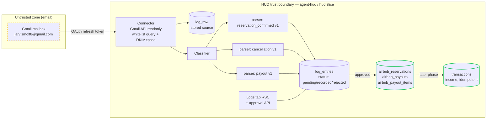

# Logs — Email Ingestion Pipeline + Airbnb Ledger

## Context

The operator runs an Airbnb listing ("Smart Cozy Warm Minimalist in Cagayan de Oro City", listing `977049623688034712`). Airbnb sends templated notification emails — booking confirmations, cancellations, payouts — to a Gmail inbox the operator controls (`jarvismolt8@gmail.com`). Today those emails are read by hand; the financial reality of the business (what was earned, when money actually arrived, which bookings are live vs canceled) lives only in a mailbox.

The operator wants a new **Logs** domain in HUD that:

1. **Ingests** the relevant emails from the inbox (read-only).
2. **Filters** them by a manually-curated **sender whitelist** (e.g. `automated@airbnb.com`), with an **approval state** before an entry is officially recorded — and a future "do not ask again" path plus a web-app toggle to disable approval entirely.
3. **Records** each email as a structured row, viewable in a new **Logs** tab. *(This is "Phase 1" in the operator's framing — once recording is reliable, the rest follows.)*
4. **Later** drives two payoffs: (a) an **Airbnb tab** consolidating bookings, earnings, and a balance sheet, and (b) **automatic income posting into Cashflow** from payout emails.

This is a **new domain module + a data-source connector** — not the "Knowledge" phase (vault/notes) currently next on the roadmap. It depends on Cashflow being live (it is — Tickets 04/05/10) and reuses the established invariants: `INTEGER` minor-unit money (`hud-money`), one `audit_log` row per write (`hud-audit`), one core lib called by many surfaces (`26060701` §1).

Operator answers that shaped this design (session 2026-06-12):

- **Access:** operator controls the inbox and can set up Gmail API OAuth *or* IMAP. Read-only — HUD never sends, deletes, or marks-read.
- **Money:** record **only the payout** (net money actually received) into Cashflow. The Airbnb tab gets the per-booking breakdown for a balance sheet. Currency **PHP (₱)**, centavo precision required (e.g. `124.56`).
- **Parsing:** Airbnb emails are templated → **deterministic parsers**. Format may drift over 1–2 years → build a **versioned, configurable parser structure** that adjusts without a rewrite.
- **Filtering:** **manual sender whitelist**; never ingest non-whitelisted senders. Logging is **automatic**, but with an **approval state first**; later a "do not ask again" toggle, plus a web-app config to enable/disable approval globally.
- **Scope:** source-agnostic schema, **Airbnb-only parsers** at Phase 1.

### Real samples reviewed this session (the source of truth for parsers)

| Type | Subject shape | Key fields available |
|---|---|---|
| Reservation confirmed | `Reservation confirmed - <Guest> arrives <date>` | guest name, confirmation code (`HMJ9JX4ZYZ`), listing name, check-in/checkout datetimes, guest count, guest-paid breakdown, host-payout breakdown incl. **"You earn ₱1,504.05"** (projected) |
| Cancellation | `Canceled: Reservation <code> for <dates>` | confirmation code (`HM8NAAMTHH`), listing name + listing # (`977049623688034712`), date range, guest count, guest name, refund note |
| Payout | `We sent a payout of ₱<total> PHP` | payout total (`₱49,878.59`), sent date, expected arrival, bank label (`Kevin Aton, 4131 (PHP)`), Airbnb account ID (`39777780`), and an **itemized list**: per reservation = guest, **net amount**, date range, listing name+#, confirmation code |

The **payout email is the money source of truth** and uniquely carries a per-reservation net breakdown keyed by confirmation code — it both feeds Cashflow (the aggregate) and backfills the Airbnb ledger (the items). Confirmation code (`HM[A-Z0-9]{8}`) is the natural key tying confirmations, cancellations, and payout items to one reservation.

## Strategic Objective

- **3 months (Phase 1 exit — "recording works"):** A systemd timer pulls new whitelisted Airbnb emails from `jarvismolt8@gmail.com` read-only, verifies DKIM, stores the raw message, and a deterministic parser produces a structured row. The new **Logs** tab shows every recorded email; unrecognized/unapproved ones sit in a `pending` state the operator approves or rejects. Zero money has moved into Cashflow yet — recording is the deliverable, and it is correct against the three real samples.
- **12 months:** The **Airbnb tab** shows a balance sheet — every booking (confirmed / canceled / paid out), projected vs realized earning, joined by confirmation code; payout emails post a single net income row into Cashflow idempotently with `actor='system:logs-payout'`. Adding a second listing or a second whitelisted sender is config, not code. An Airbnb template change is absorbed by adding a parser `v2` and re-parsing stored raws — no data loss.
- **24 months:** "Logs" is a generic artifact ledger. A second source (e.g. a bank statement email, a utility bill, a different platform) drops in as a new connector + parser namespace against the same `log_entries` spine and the same approval workflow. The Airbnb ledger is one consumer of Logs, not the whole of it.

## Current State

### Verified this session
- Money invariant is `INTEGER` signed minor units via `@hud/money` (`parseMoney`/`formatMoney`/`sumMinor`/`pctDelta`); PHP minor unit = centavo. Per `.claude/skills/hud-money/SKILL.md`.
- Audit invariant: every state change writes one `audit_log` row in the same Drizzle transaction, via `writeAudit(tx, entry)`; actor is a closed-ish set extended per blueprint with prefix-based CHECK constraints (`26060701` A0, `26060901` B0). Per `.claude/skills/hud-audit/SKILL.md`.
- `transactions` already has `external_id` with a partial UNIQUE index `idx_tx_external (user_id, external_id) WHERE external_id IS NOT NULL` and `source` column (`manual`/`csv-import`/`agent`) — the idempotency hook for posting Airbnb payouts exists already (`26060502` schema).
- Core-lib pattern: `apps/web/lib/db/*.ts` are pure, audit-aware functions taking `userId` + `ReqCtx`; callers are RSC reads, `/api` writes, and `packages/mcp-hud` tools (`26060701` §1).
- Cashflow CRUD + UI are done (Kanban: Tickets 04, 05, 10 in Done).

### Not yet existing
- Any email connector, OAuth/IMAP credential, or Gmail integration.
- `log_*` / `airbnb_*` tables; the `(app)/logs` route; the Logs tab in the nav shell.
- A settings store for the approval toggle / auto-approve rules / whitelist.
- An `actor` value for an internal automated ingestion worker (the current enum covers `user`, `agent:<persona>/<cli>`, `platform:<name>`, `system` — no `system:<job>` sub-tier).
- A scheduled-job pattern on the server (no systemd timers yet; only long-running services).

### Constraints
- Headless server; the only interactive step tolerable is a **one-time** OAuth consent run on the operator's laptop.
- Single operator, single listing today; schema must not preclude multi-listing or multi-source.
- Emails are **untrusted external input** crossing a **new trust boundary**, and the inbox credential is a **new high-value secret**.

## Proposed Approach

A four-stage pipeline — **ingest → classify → record → (project / post)** — where each stage is independently shippable and the money-bearing stage is gated behind everything before it.



### 1. Connector — Gmail API, read-only

**Recommendation: Gmail API with `https://www.googleapis.com/auth/gmail.readonly`.** Direct answer to "which is easier on a headless box":

- **IMAP + app password** is *easier to stand up* (no Google Cloud project; username + app password in `.env`; connect `imap.gmail.com:993` over TLS). But: the credential is a **long-lived, full-mailbox** static secret (IMAP cannot scope to read-only — we'd only *choose* not to write), Google is actively narrowing basic-auth/app-password access, and incremental sync is clumsy (UID + IDLE/poll).
- **Gmail API** costs a **one-time** browser consent (run a tiny script on the laptop via the installed-app loopback flow → capture a **refresh token**). After that it is **fully headless forever**: refresh token → short-lived access token, no re-auth. It is **read-only at the protocol level** (the scope cannot send or delete even if the token leaks), revocable from the Google console, and gives **server-side query filtering** (`from:` whitelist applied before we ever fetch a body), `historyId` incremental sync, and per-message DKIM/auth results.

For a security-first, headless, single-operator system, Gmail API read-only wins. IMAP is the documented fallback if GCP setup is blocked (see Debt Incurred).

**Connector behavior:**
- Auth: refresh token in sops/age (`plan/reference/secrets.md` workflow), decrypted into `/srv/hud/secrets/logs-gmail.env` (mode 600, owner `agent-hud`). Never in git, never in the client bundle.
- Fetch: build the Gmail `q` query from the **enabled whitelist rows** (`from:(automated@airbnb.com) newer_than:...`). We only ever pull messages matching the whitelist — non-whitelisted mail is never fetched, satisfying "never read emails not in the whitelist."
- **Authenticity gate:** before trusting a message, require **`dkim=pass` for `d=airbnb.com`** (read the `Authentication-Results` / verify the DKIM result Gmail exposes). A message failing DKIM is stored as `parse_failed`/`rejected` with a reason and **never** flows to the Airbnb ledger or Cashflow. This is the control that stops a forged `From: automated@airbnb.com` from injecting a fake payout.
- Idempotency: Gmail immutable `message.id` → `log_entries.external_ref` UNIQUE. Re-runs are no-ops.
- Incremental: persist last `historyId` (or last `internalDate`) in settings; first run backfills all whitelisted history (idempotent).
- **Store raw first, parse second.** The raw message (headers + text + html) lands in `log_raw` before parsing. If a parser fails or Airbnb changes format, the source is retained for re-parsing — the parser is never the only copy of the truth.

### 2. Classifier + versioned parsers

A small registry. The classifier picks a parser by `(sender, subject pattern)`; the parser extracts fields and returns `parsed_json` or a structured `ParseError`.

```
packages/logs-ingest/
├── src/
│   ├── connector/gmail.ts        # readonly fetch, whitelist query, DKIM gate
│   ├── classify.ts               # (sender, subject) -> parser key
│   ├── parsers/
│   │   ├── registry.ts           # key -> { version, match, parse }
│   │   └── airbnb/
│   │       ├── reservation_confirmed.v1.ts
│   │       ├── cancellation.v1.ts
│   │       └── payout.v1.ts
│   ├── run.ts                    # pipeline: fetch -> store raw -> classify -> parse -> record
│   └── lib/db.ts                 # imports @hud/db logs + airbnb libs (path alias)
└── README.md
```

**Parser contract (handles format drift):**
- Each parser declares a `version`. `parsed_json` stores the version that produced it.
- Brittle selectors (subject regex, label anchors like "Confirmation code", "You earn", "Total paid:") live as **named config constants** at the top of each parser, not scattered inline — "prepare the structure where we can easily configure later."
- When Airbnb changes a template: add `reservation_confirmed.v2.ts`, register it, and re-run the pipeline in **re-parse mode** over stored `log_raw` to upgrade affected entries. Old versions stay for provenance.
- **Money parsing goes through `@hud/money parseMoney`** — strip `₱`/`PHP`/commas, honor leading `-` (host service fee `-₱315.95`), produce centavo `INTEGER`. The LLM is **never** in the money path.
- Date parsing is the known hazard: emails mix `Sat, Jun 13`, `Jun 13 – 14, 2026`, `4/17/2026 - 4/19/2026`, `June 4`, and some omit the year. Parsers resolve year from the message `internalDate` context and store ISO-8601 with Asia/Manila offset. Ambiguous dates → `parse_failed` with reason, surfaced for approval rather than guessed.

### 3. Data model

Two layers: a **source-agnostic ledger** and an **Airbnb domain** derived from it. All money columns are `INTEGER` minor units (centavos), currency `PHP` default. Every write goes through an audit-aware lib function.

```sql
-- ── Generic ingestion layer (source-agnostic) ──────────────────────────

CREATE TABLE log_whitelist (
  id          INTEGER PRIMARY KEY,
  user_id     INTEGER NOT NULL REFERENCES users(id),
  source      TEXT NOT NULL DEFAULT 'email',
  sender      TEXT NOT NULL,                 -- 'automated@airbnb.com'
  enabled     INTEGER NOT NULL DEFAULT 1,
  note        TEXT,
  created_at  TEXT NOT NULL DEFAULT (datetime('now')),
  UNIQUE(user_id, source, sender)
);

CREATE TABLE log_entries (
  id             INTEGER PRIMARY KEY,
  user_id        INTEGER NOT NULL REFERENCES users(id),
  source         TEXT NOT NULL DEFAULT 'email',
  source_account TEXT NOT NULL,              -- 'jarvismolt8@gmail.com'
  external_ref   TEXT NOT NULL,              -- Gmail message id (idempotency)
  sender         TEXT NOT NULL,
  subject        TEXT,
  received_at    TEXT NOT NULL,              -- ISO-8601 from message internalDate
  dkim_pass      INTEGER NOT NULL DEFAULT 0, -- 1 only if DKIM verified for airbnb.com
  kind           TEXT NOT NULL DEFAULT 'unknown',  -- 'airbnb.reservation_confirmed' | 'airbnb.cancellation' | 'airbnb.payout' | 'unknown'
  parser_version TEXT,
  parsed_json    TEXT,                       -- structured extraction (NEVER fed raw to an LLM)
  status         TEXT NOT NULL DEFAULT 'pending'
                 CHECK (status IN ('pending','recorded','rejected','parse_failed')),
  status_reason  TEXT,
  created_at     TEXT NOT NULL DEFAULT (datetime('now')),
  updated_at     TEXT NOT NULL DEFAULT (datetime('now')),
  UNIQUE(user_id, source, external_ref)
);
CREATE INDEX idx_log_user_status ON log_entries(user_id, status, received_at DESC);
CREATE INDEX idx_log_user_kind   ON log_entries(user_id, kind, received_at DESC);

CREATE TABLE log_raw (
  log_entry_id INTEGER PRIMARY KEY REFERENCES log_entries(id) ON DELETE CASCADE,
  headers_json TEXT,
  body_text    TEXT,
  body_html    TEXT
);

-- auto-approve / ignore rules ("do not ask again")
CREATE TABLE log_rules (
  id         INTEGER PRIMARY KEY,
  user_id    INTEGER NOT NULL REFERENCES users(id),
  source     TEXT NOT NULL DEFAULT 'email',
  sender     TEXT,                           -- nullable = any sender
  kind       TEXT NOT NULL,                  -- which classified kind this rule applies to
  action     TEXT NOT NULL CHECK (action IN ('auto_approve','ignore')),
  created_at TEXT NOT NULL DEFAULT (datetime('now')),
  UNIQUE(user_id, source, sender, kind, action)
);

-- generic per-user settings (approval toggle lives here)
CREATE TABLE app_settings (
  user_id    INTEGER NOT NULL REFERENCES users(id),
  key        TEXT NOT NULL,                  -- 'logs.approval_required'
  value      TEXT NOT NULL,                  -- 'true' | 'false'
  updated_at TEXT NOT NULL DEFAULT (datetime('now')),
  PRIMARY KEY (user_id, key)
);

-- ── Airbnb domain layer (derived from approved log_entries) ─────────────

CREATE TABLE airbnb_reservations (
  id                     INTEGER PRIMARY KEY,
  user_id                INTEGER NOT NULL REFERENCES users(id),
  confirmation_code      TEXT NOT NULL,            -- HM........  (natural key)
  listing_id             TEXT,
  listing_name           TEXT,
  guest_name             TEXT,
  check_in               TEXT,                     -- ISO date
  check_out              TEXT,
  nights                 INTEGER,
  guests_count           INTEGER,
  status                 TEXT NOT NULL DEFAULT 'confirmed'
                         CHECK (status IN ('confirmed','canceled','paid_out')),
  currency               TEXT NOT NULL DEFAULT 'PHP',
  gross_total_minor      INTEGER,                  -- guest paid total (from confirmed email)
  cleaning_fee_minor     INTEGER,
  host_service_fee_minor INTEGER,                  -- signed negative
  projected_earning_minor INTEGER,                 -- "You earn" (confirmed email)
  realized_earning_minor  INTEGER,                 -- from payout item (actual)
  source_log_entry_id    INTEGER REFERENCES log_entries(id),
  created_at             TEXT NOT NULL DEFAULT (datetime('now')),
  updated_at             TEXT NOT NULL DEFAULT (datetime('now')),
  UNIQUE(user_id, confirmation_code)
);
CREATE INDEX idx_resv_user_status ON airbnb_reservations(user_id, status, check_in);

CREATE TABLE airbnb_payouts (
  id                     INTEGER PRIMARY KEY,
  user_id                INTEGER NOT NULL REFERENCES users(id),
  external_ref           TEXT NOT NULL,            -- Gmail message id of payout email
  currency               TEXT NOT NULL DEFAULT 'PHP',
  payout_total_minor     INTEGER NOT NULL,         -- ₱49,878.59 -> 4987859
  sent_date              TEXT,
  expected_arrival_date  TEXT,
  bank_account_label     TEXT,                     -- 'Kevin Aton, 4131 (PHP)'
  airbnb_account_id      TEXT,
  source_log_entry_id    INTEGER REFERENCES log_entries(id),
  cashflow_transaction_id INTEGER REFERENCES transactions(id),  -- set when posted (later phase)
  created_at             TEXT NOT NULL DEFAULT (datetime('now')),
  updated_at             TEXT NOT NULL DEFAULT (datetime('now')),
  UNIQUE(user_id, external_ref)
);

CREATE TABLE airbnb_payout_items (
  id                INTEGER PRIMARY KEY,
  payout_id         INTEGER NOT NULL REFERENCES airbnb_payouts(id) ON DELETE CASCADE,
  confirmation_code TEXT NOT NULL,                 -- joins airbnb_reservations
  guest_name        TEXT,
  amount_minor      INTEGER NOT NULL,              -- net for this reservation
  date_range_start  TEXT,
  date_range_end    TEXT,
  listing_id        TEXT,
  listing_name      TEXT,
  created_at        TEXT NOT NULL DEFAULT (datetime('now'))
);
CREATE INDEX idx_payitem_code ON airbnb_payout_items(confirmation_code);
```

**Upsert semantics (by confirmation code):** a `reservation_confirmed` upserts the reservation with `projected_earning_minor` and `status='confirmed'`. A `cancellation` upserts (creating a stub if unseen) and sets `status='canceled'`. A `payout` creates the payout + items and, per item, upserts the reservation's `realized_earning_minor` and `status='paid_out'`. Because the natural key is the confirmation code, payout items **backfill** reservations we never received a confirmation email for (historical bookings) — important for a complete balance sheet.

### 4. Approval workflow + config

State machine for a freshly-parsed entry:

```
parsed OK ─┬─ approval_required = false  ───────────────► recorded
           ├─ log_rules: auto_approve for (sender,kind) ─► recorded
           ├─ log_rules: ignore for (sender,kind) ───────► rejected (reason: rule)
           └─ otherwise ─────────────────────────────────► pending
parse fail ──────────────────────────────────────────────► parse_failed
DKIM fail ───────────────────────────────────────────────► rejected (reason: dkim)
```

- **Global toggle:** `app_settings['logs.approval_required']` (default `true`), flipped from a Logs settings panel in the web app — the operator's "enable/disable approval of logging" control.
- **Per-kind "do not ask again":** approving a `pending` entry offers "approve and stop asking for this type" → inserts a `log_rules` `auto_approve` row. Future entries of that kind auto-record.
- Only `recorded` entries project into the Airbnb domain tables. `pending`/`rejected`/`parse_failed` never touch the ledger or Cashflow.
- Approve/reject are **operator** actions in the browser → `actor='user'`. Ingestion writes are worker actions → `actor='system:logs-ingest'`. Later payout→Cashflow posting → `actor='system:logs-payout'`.

### 5. Code layout (follows the one-core-lib pattern)

- `apps/web/lib/db/logs.ts` — audit-aware core lib: `recordIngestedEntry`, `listEntries`, `approveEntry`, `rejectEntry`, `setApprovalRequired`, `upsertRule`, whitelist CRUD. Takes `userId` + `ReqCtx`.
- `apps/web/lib/db/airbnb.ts` — `upsertReservation`, `markCanceled`, `recordPayout` (+ items), reservation/payout/balance-sheet queries. Audit-aware.
- `packages/logs-ingest/` — connector + parsers + pipeline runner; imports the libs via `@hud/db/*` alias (same pattern `packages/mcp-hud` uses). Runs as a scheduled job.
- `apps/web/app/(app)/logs/` — RSC read view (entries table, filters by kind/status), approval actions, settings panel. New **Logs** entry in the nav shell `TabBar`.
- `apps/web/app/api/logs/...` — approve/reject/rules/whitelist/settings write routes (session-gated, CSRF, Zod).
- `ops/systemd/hud-logs-ingest.service` + `hud-logs-ingest.timer` — periodic pull (e.g. every 15 min), `User=agent-hud`, `Slice=hud.slice`, `NoNewPrivileges=true`, `ProtectSystem=strict`, `ReadWritePaths=/srv/hud/data`, env from `/srv/hud/secrets/logs-gmail.env`.

### 6. Scheduling

A **systemd timer** (poll every ~15 min) at MVP — boring, observable (`systemctl status`, `journalctl`), no new infra. Gmail push (Pub/Sub `watch`) is lower-latency but adds a public webhook + Pub/Sub topic + renewal cron; deferred until latency is a felt problem (see Debt Incurred).

## Alternatives Considered

**A. IMAP + app password instead of Gmail API.** Easier setup, no GCP project. Rejected as the *primary* because the credential is long-lived full-mailbox access, app-passwords are being narrowed by Google, and incremental sync is clumsy. Kept as the documented fallback if GCP setup is blocked — with its debt logged.

**B. LLM extraction (Emily/Andrea parse the email).** Flexible against template drift. Rejected for the money path: it introduces prompt injection across the new untrusted boundary and puts an LLM between an attacker-controlled email and an `INTEGER` that lands in Cashflow. Deterministic parsers are reliable and auditable; an LLM may *summarize* an entry later, but only from `parsed_json`, never raw body.

**C. Store only parsed fields; discard the raw email.** Smaller DB. Rejected: when Airbnb changes a template (operator expects this in 1–2 years), the only way to recover correctly is to re-parse the original. Storing raw + re-parse mode is the format-drift insurance the operator explicitly asked for.

**D. Post one Cashflow income row per reservation (itemized).** Rejected per operator: only the **payout** is real money. One net income row per payout; the per-reservation detail lives in the Airbnb ledger for the balance sheet. (The schema keeps both, so this is reversible if the operator later wants itemized posting.)

**E. Gmail push (Pub/Sub watch) instead of a poll timer.** Lower latency. Rejected at MVP: adds a public HTTPS webhook endpoint, a Pub/Sub topic, and a 7-day `watch` renewal job — real attack surface and ops for a workload where 15-minute latency is fine. Deferred with a trigger.

**F. Dedicated config tables per concern vs one generic `app_settings`.** Chose a generic key/value `app_settings` for simple toggles (more toggles are coming HUD-wide) but dedicated tables (`log_whitelist`, `log_rules`) for relational config that needs uniqueness/queries. Mixed on purpose.

## Security & Threat Model

### Trust boundaries

```
[Airbnb / internet] ──► [Gmail mailbox]  ◄── UNTRUSTED external input
        │ OAuth refresh token (readonly scope)
        ▼
[HUD: agent-hud / hud.slice]
   connector (DKIM gate, whitelist) ─► log_raw / log_entries ─► airbnb_* ─► (later) transactions
```

Two new untrusted things: **email content** (attacker-influenceable) and the **inbox credential** (a new high-value secret). The DKIM gate + deterministic parsing + approval state + read-only scope are the layered defenses.

### STRIDE

- **Spoofing.** `From: automated@airbnb.com` is trivially forgeable. Control: **require `dkim=pass` for `d=airbnb.com`** before an entry is trusted; DKIM-fail → `rejected`, never reaches the ledger or Cashflow. Gmail-side spam filtering is a second layer. Connector authenticates to Gmail with an OAuth refresh token (read-only scope).
- **Tampering.** A crafted email could carry manipulated amounts/dates. Controls: DKIM gate (authenticity), deterministic parser (no eval of content), `parse_failed`/`pending` surfacing of anomalies, and the money path being **gated/manual until a later phase** (recording ≠ posting). Money is `INTEGER` via `parseMoney`; no float rounding attack.
- **Repudiation.** Every record/approve/reject/post writes one `audit_log` row (`actor` ∈ {`system:logs-ingest`, `user`, `system:logs-payout`}), and the **raw email is retained** in `log_raw` for forensic re-parse. `external_ref` ties an entry to an immutable Gmail message id.
- **Information disclosure.** Emails contain **PII** (guest names) and financial data (payout amounts, bank label `Kevin Aton, 4131`, Airbnb account id). Controls: stored only in HUD's SQLite (file perms + Litestream→R2 at rest); **never sent to any LLM or to Sentry** (parsers are deterministic; Sentry `beforeSend` scrubs `parsed_json`/`body_*`); PII classified and retention-bounded (OQ-1). The OAuth scope is read-only, so a token leak cannot exfiltrate by *sending* mail.
- **Denial of service.** Gmail API quotas + the 15-min timer bound fetch volume; the connector caps messages/run and bytes/message (payout emails can have many line items — cap and paginate). Parser failures isolate to one entry (`parse_failed`), never crash the run. SQLite WAL handles writer concurrency with `hud-web`.
- **Elevation of privilege.** Ingestion worker runs as `agent-hud`, no sudo, `NoNewPrivileges=true`, `ProtectSystem=strict`. Read-only Gmail scope means the worst a compromised worker can do is read this one mailbox — it cannot send, delete, or reach other Google data.

### Controls (mapped to threats)

| Threat | Control | Layer |
|---|---|---|
| Forged Airbnb email → fake income | `dkim=pass` for airbnb.com required before trust | App / connector |
| Non-whitelisted mail ingested | Gmail `q` query built from enabled whitelist only | Connector |
| Prompt injection into an agent | Deterministic parsers; agents read `parsed_json`, never raw body | Design invariant |
| Money rounding/float | `@hud/money parseMoney` → `INTEGER` centavos; no LLM in money path | Lib |
| Credential leak → mailbox abuse | `gmail.readonly` scope; sops/age; mode 600; revocable; rotate | Secrets / IAM |
| PII/financial leak to 3rd parties | No LLM/Sentry exposure of bodies; retention policy; disk perms | App / policy |
| Duplicate ingestion | `external_ref` UNIQUE; re-runs are no-ops | DB |
| Duplicate Cashflow posting (later) | `transactions.external_id='airbnb:payout:<ref>'` UNIQUE + `cashflow_transaction_id` backref | DB |
| Format drift loses data | Store raw + versioned parsers + re-parse mode | App / DB |

### Residual risk
- **DKIM bypass / Airbnb signing change.** If Airbnb rotates DKIM selectors or a verification edge case slips, a real email could be wrongly rejected (fail-closed — safe) or, worse, a forgery wrongly accepted (requires breaking DKIM — low). Mitigation: approval state catches anomalies; payout posting is later and reviewable.
- **PII at rest.** Guest names + bank label live in SQLite, replicated to R2. Field-level encryption is *not* done at MVP (disk perms + R2 encryption + access control only). Trigger to revisit in OQ-1 / Debt.
- **Operator over-trusts auto-approve.** Once "do not ask again" is set for a kind, a malformed-but-DKIM-valid email records silently. Mitigation: `parse_failed` still surfaces; the global toggle can re-arm approval.

## Risks & Mitigations

| Risk | Detection | Response |
|---|---|---|
| Airbnb changes a template → parser misreads | Vitest fixtures drift; `parse_failed` rate rises; field sanity checks (e.g. items sum ≠ payout total) | Add parser `vN+1`; re-parse stored raws; alert if items don't sum to total |
| Payout item amounts don't sum to payout total | Assertion in `recordPayout` (`sumMinor(items) === payout_total_minor`) | Flag entry `parse_failed`; require manual approval; don't post to Cashflow |
| OAuth refresh token expires/revoked | Connector 401; Uptime Kuma probe on last-successful-run timestamp | Re-run laptop consent; replace token in sops; document in runbook |
| Timer silently stops (no new entries ever) | "last successful ingest" heartbeat metric; alert if > N hours | Restart timer; check `journalctl -u hud-logs-ingest` |
| Duplicate rows from re-ingest | UNIQUE on `external_ref` | No-op by design; verify index present |
| Date with no year parsed to wrong year | Range sanity (check_out ≥ check_in; dates near received_at) | `parse_failed` on implausible dates |
| PII in a Sentry event | Sentry `beforeSend` scrub test in CI | Block release; fix scrub |

## Phased Implementation

**Phase 1 (operator's "recording works") = L0–L4.** The Airbnb tab + Cashflow posting are L5, explicitly later.

| Phase | Outcome | Depends on | Effort | Exit criteria |
|---|---|---|---|---|
| **L0 — Schema + actor tier** | Drizzle migration for all `log_*` + `airbnb_*` + `app_settings` tables; extend `audit_log.actor` CHECK to add `OR actor LIKE 'system:%'`; seed default `logs.approval_required=true` and the `automated@airbnb.com` whitelist row | — | S (1d) | Migration applies on a prod-DB copy with zero invalidated rows; `INSERT actor='system:logs-ingest'` accepted, bad actor rejected; tables exist |
| **L1 — Gmail connector (capture only)** | `packages/logs-ingest` connector: readonly OAuth, whitelist `q` query, **DKIM gate**, store `log_raw`, create `log_entries` with `kind='unknown'`, idempotent by `external_ref`. No parsing yet | L0 | M (2–3d) | Against the real inbox (or a fixture mailbox), whitelisted+DKIM-pass messages create `log_entries`+`log_raw`; non-whitelisted never fetched; DKIM-fail → `rejected`; re-run inserts nothing new |
| **L2 — Airbnb parsers v1** | Classifier + `reservation_confirmed.v1`, `cancellation.v1`, `payout.v1`; populate `parsed_json`; upsert `airbnb_reservations` / `airbnb_payouts` / `airbnb_payout_items` by confirmation code; money via `@hud/money`; Vitest fixtures = the **three real samples** | L1 | M (3d) | The three samples parse to expected structured values (codes, dates, ₱ centavos incl. `-₱315.95` and `₱49,878.59`); payout items sum to total; cancellation flips status; re-parse mode works |
| **L3 — Logs tab + approval** | `(app)/logs` RSC list (filter by kind/status), approve/reject API, "do not ask again" rule, settings panel for `logs.approval_required`; nav tab added; per `hud-ui` styling | L2 | M (2–3d) | Operator sees entries; approving moves `pending→recorded` and projects into `airbnb_*`; "don't ask again" auto-records future same-kind; toggling approval off auto-records new entries; every action writes `audit_log` |
| **L4 — Schedule + observability + secrets** | `hud-logs-ingest.{service,timer}` (15-min), sops/age for the refresh token, last-successful-run heartbeat, Sentry breadcrumbs + PII scrub test, ingestion runbook in `plan/reference/` | L3 | S (1d) | Timer runs on the server; new emails appear within one interval; token in sops, file mode 600; heartbeat visible in Uptime Kuma; runbook dry-run passes |
| **L5a — Airbnb tab (balance sheet)** | `(app)/airbnb` consolidated view: bookings list (confirmed/canceled/paid_out), projected vs realized per booking, payout history, totals; read-only RSC over `airbnb_*` | L2 | M (2–3d) | Balance sheet renders the seeded/real data correctly; projected vs realized reconcile; canceled bookings excluded from earnings totals |
| **L5b — Payout → Cashflow posting** | On a `recorded` payout, post **one** net income `transaction` (`source='airbnb'`, `external_id='airbnb:payout:<ref>'`, occurred_at=sent_date Asia/Manila), set `cashflow_transaction_id`; `actor='system:logs-payout'`; idempotent | L5a, Cashflow | S (1d) | A payout creates exactly one income row; re-run creates none (UNIQUE `external_id`); amount matches `payout_total_minor`; visible in Cashflow with correct delta; audit row present |

**Total Phase 1 (L0–L4): ~9–11 person-days. L5a–L5b: ~4–5 person-days.**

## Success Criteria

- A whitelisted, DKIM-passing Airbnb email in `jarvismolt8@gmail.com` becomes a `log_entries` row with stored raw within one timer interval, idempotently.
- The three real sample emails parse to exact expected values — confirmation codes (`HMJ9JX4ZYZ`, `HM8NAAMTHH`), centavo integers (`-₱315.95 → -31595`, `₱49,878.59 → 4987859`, projected `₱1,504.05 → 150405`), dates as ISO Asia/Manila — verified by Vitest fixtures.
- A forged `From: automated@airbnb.com` lacking valid DKIM is `rejected` and never reaches `airbnb_*` or `transactions`.
- Payout items always sum to the payout total, or the entry is `parse_failed` (never silently posted).
- With approval ON, a new kind sits `pending`; approving with "don't ask again" auto-records future same-kind; the web toggle disables approval globally.
- Every record/approve/reject/post writes exactly one `audit_log` row with the correct `system:*` or `user` actor.
- (L5b) A payout posts exactly one idempotent net income row into Cashflow; re-running the ingest creates no duplicate.
- A simulated Airbnb template change is absorbed by adding a parser `v2` + re-parse, with **zero** raw-data loss.

## Open Questions

- **OQ-1. PII retention + encryption.** How long do we keep raw emails (guest names, bank label)? Proposal: retain `log_raw` 24 months, then purge body fields but keep structured `parsed_json` + `airbnb_*`. Field-level encryption deferred (disk perms + R2 at rest only) — accept, or require encryption now?
- **OQ-2. Cashflow income shape (L5b).** One income row per payout (proposed, per operator) categorized as `Airbnb` income, `occurred_at = sent_date` (Asia/Manila). Confirm category name and whether to use sent_date vs expected_arrival_date.
- **OQ-3. Multiple Airbnb listings.** Today one listing (`977049623688034712`). Schema is multi-listing ready. Confirm no second listing imminent (affects the Airbnb tab grouping UI).
- **OQ-4. Historical backfill depth.** First run: ingest *all* available whitelisted history (proposed, idempotent), or only from go-live forward? Backfill gives a complete ledger but pulls more PII at once.
- **OQ-5. DKIM strictness.** Reject on DKIM-fail (proposed, fail-closed) vs record as `pending` with a warning. Stricter is safer for money; confirm.
- **OQ-6. Roadmap placement.** This is a new domain, not the queued "Knowledge" phase. Insert as its own roadmap row in `plan/HUD.md` (e.g. a "Logs / Airbnb Ledger" phase) — I'll add the row on your go-ahead; tell me where it sits relative to Phase 3 (Knowledge).
- **OQ-7. Reservation-confirmed "You earn" vs payout net.** Both stored (projected vs realized). For the balance sheet, treat **payout net as authoritative**; confirmed "You earn" is the forecast. Confirm that framing.

## Debt Incurred

- **IMAP fallback path.** If GCP OAuth setup is blocked, L1 may ship with IMAP + app password instead. Debt: long-lived full-mailbox credential, weaker than read-only scope. Trigger to revert to Gmail API: GCP project becomes available. Owner: operator.
- **Poll timer, not Gmail push.** Up to ~15-min latency. Trigger to add Pub/Sub `watch`: latency becomes a felt problem or near-real-time posting is wanted. 
- **No field-level PII encryption at MVP.** Relies on disk perms + R2-at-rest + access control. Trigger: a second human gains DB/file access, or a compliance need appears (OQ-1).
- **Cashflow posting deferred to L5b.** Phase 1 records but does not post money — deliberate (recording must be proven first). Trigger: L5a balance sheet reconciles cleanly against real payouts.

## Tasks

Tickets to be created by the orchestrator (after Open Questions are confirmed). Intended set:

- Ticket NN — L0: Drizzle migration for `log_*` + `airbnb_*` + `app_settings`; extend `audit_log.actor` CHECK with `system:%`; seed defaults + whitelist
- Ticket NN — L1: `packages/logs-ingest` Gmail read-only connector — whitelist query, DKIM gate, store raw, idempotent `log_entries` (capture-only)
- Ticket NN — L2: Airbnb classifier + `reservation_confirmed`/`cancellation`/`payout` v1 parsers + `airbnb_*` upserts; Vitest against the three real samples
- Ticket NN — L2 sub-task: `apps/web/lib/db/airbnb.ts` audit-aware domain lib (upsert reservation, mark canceled, record payout + items)
- Ticket NN — L3: `(app)/logs` tab — entries list, approve/reject API, "do not ask again" rule, approval-toggle settings panel
- Ticket NN — L4: `hud-logs-ingest.{service,timer}`, sops/age for refresh token, heartbeat + Sentry scrub, ingestion runbook in `plan/reference/`
- Ticket NN — L5a: `(app)/airbnb` balance-sheet view (bookings, projected vs realized, payout history)
- Ticket NN — L5b: payout → single idempotent Cashflow income posting (`external_id='airbnb:payout:<ref>'`, `actor='system:logs-payout'`)

Implementing tickets must reference these skills:

- `.claude/skills/hud-money/SKILL.md` — money is INTEGER minor units; parse via `@hud/money`, never an LLM
- `.claude/skills/hud-audit/SKILL.md` — every write produces one `audit_log` row in-transaction; new `system:*` actor tier
- `.claude/skills/hud-db/SKILL.md` — Drizzle schema + migration conventions
- `.claude/skills/hud-ui/SKILL.md` — Logs/Airbnb tabs match the cyberpunk design system
- `.claude/skills/obsidian-vault/SKILL.md` — for the L4 runbook in `plan/reference/`

These tickets need ticket numbers and files from the orchestrator — **switch to the orchestrator to create them.**
